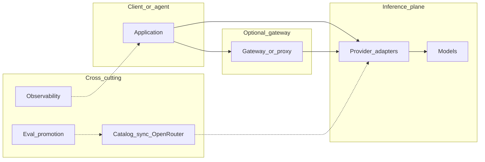
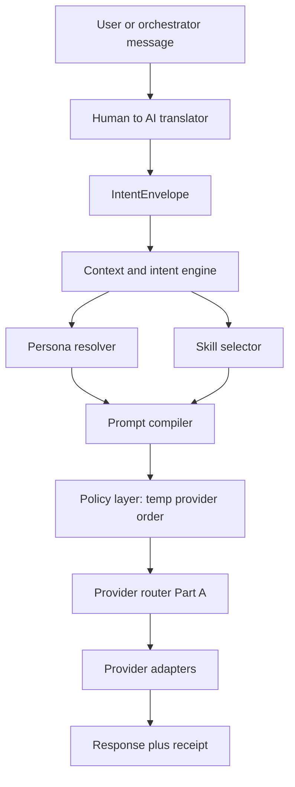
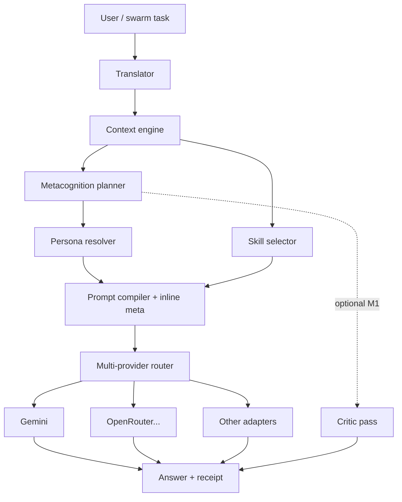

# FREE AI — Blueprint & Investigation Report

**Single source of truth:** **Only this file exists** for the FREE AI effort until you explicitly start implementation. `FREE AI/FREEAI.md` holds **all** rules, algorithms, and **every executable excerpt** (PowerShell, shell, YAML, configs) inside fenced blocks — **§34** and elsewhere. Do **not** add sibling scripts, workflow files, or config files under `FREE AI/` while the blueprint is unfinished; extract them when you open the application repo. No other document or repo path is authoritative.

**Purpose:** Multi-provider free / near-free AI routing, fallbacks, personas, skills, metacognition, automated model-pin hygiene, and runnable sync tooling.

**Owner-enforced integration policy:** FREE AI is a copy-only engine. It MUST be copied fully into any destination project that uses it. This source repository MUST NOT be used as a shared wrapper, remote runtime, live reference, symlink target, or package-style dependency for other projects.

**Record:** First consolidated 2026-04-09; industry OSS reference map **§3**; automation program **§33**; execution bundle **§34**; production gap / SOTA rubric **§35** (2026-04-09).

---

## 1. Executive summary

Two complementary **patterns** (defined fully in **§2** and **§33**):

| Pattern | Strength |
|--------|----------|
| **Deterministic router + registry** | Persona-aware ordering, HTTP-status cooldowns, pinned primary/fallback models, local KB before/after cloud |
| **Dynamic free-model discovery** | Scheduled pull of OpenRouter catalog, `$0` prompt + `$0` completion filter, allowlist/denylist, sort by context then recency |
| **Streaming-first + measurable SLOs** | Streaming contract, TTFT / TPOT (ITL) as first-class metrics; streaming semantics + fallback behavior defined (see §2.11) |

Dual mandate: the blueprint targets two co-equal goals — (1) maximize free-tier routing and cognitive quality for end users (fast responses, persona-aligned output, low-cost delivery), and (2) satisfy production SLOs and SRE observability (TTFT/TPOT targets, trace coverage, cache hit rate, and automatic rollback triggers). These must both be tracked and balanced in release criteria.

A complete product layer **combines**: (1) pinned known-good models, (2) optional discovery of new free models, (3) **non-silent** degradation (metrics + user-visible fallback), (4) routing receipts: `provider_id`, `model_id`, `http_status`, `fallback_used`, `kb_short_circuit`, `persona`, and no silent empty degraded mode without an explicit flag.

**Extension (Part B):** One logical **AI runtime** should also support **multiple personas** and **dynamic skills**, selected by a **context/intent engine**, with a **Human→AI translator** that compiles user language into machine-consumable intent. The same contract applies to **swarm** workers: each agent receives an **assigned persona + skill bundle** per turn or per task. See **§13–§22**.

**Extension (Part C):** **Metacognition** (plan → act → reflect → calibrate), a **multi-vendor free-tier strategy** to stay near **latest** capable models, and a broad **provider matrix** (Google, OpenAI, Anthropic, xAI, Mistral, DeepSeek, Groq, aggregators, regional APIs, local inference). See **§24–§28** and **§30–§32** (matrix + sample skills + reference TypeScript outline).

**Industry alignment:** Common **open-source** gateway, router, inference, and Hugging Face access patterns are named and mapped in **§3** (reference only; **§2** stays normative for behavior).

**Production readiness vs industry practice:** **§35** compares this blueprint to typical production AI gateways and SRE-style LLM operations: **gap analysis**, **system comparison table**, and a **percentage rubric** (document coverage—not measured latency or throughput).

**Future projects — use this doc as standard:** For **automated free-tier model upgrades** (CI + runtime + promotion gates), follow **§33** end-to-end. §7 is a short strategy summary; §33 is the **operational program** you were missing as a single checklist.

---

## 2. Canonical provider router (normative)

This section is the **complete** specification for the “Part A” inference plane. Implement it in any language; do not depend on any external repo layout.

### 2.1 Provider registry

- Each provider has: `id`, display name, base `weight`, `tier` (`active_free` | `limited_free` | `paid_low_cost` | `reserve`), health state, consecutive failure count, cooldown timestamp, request/success counters.
- **`isConfigured(id)`:** true iff required env key for that provider is non-empty.
- **`isHealthy(record)`:** false while `now < cooldownUntil`; when cooldown expires, reset failures and mark healthy.

### 2.2 Task-fit matrix

- `PROVIDER_TASK_FIT[providerId][persona]` = integer bonus (e.g. 0–5).
- **Eligible providers** = configured ∧ healthy. Sort by `(weight + taskFitBonus)` descending.

### 2.3 Request execution

- Execution short-circuit order (normative): `gate` → `cache hit` → `router` → `try providers`. The router and provider loop are entered only if the gate and cache both do not produce a terminal result. This order ensures cheap short-circuits (KB, cache) before any vendor call, and clarifies where streaming, hedging and cache short-circuiting may interact.

- For each provider in order: call adapter with timeout (e.g. 8s); adapters MUST support both standard request/response and streaming modes. Capture HTTP status and streaming receipts on failure or partial success.
- **Success:** reset consecutive failures; return response (or stream chunks with final receipt).
- **Failure:** if HTTP status &gt; 0, apply **HTTP cooldown policy** (§2.4); else increment generic failures → degraded / cooldown after N failures (e.g. N=3, cooldown 5 min).

- Note on streaming and hedging interaction: if a route is configured `stream: true` and a streaming session begins, the router MUST treat mid-stream fatal errors as per §2.11 (streaming contract and fallback semantics). Hedging (§2.13) may spawn parallel requests only for non-streaming calls or when governed hedging for streams is explicitly allowed by tenant policy (hedged streams must be cancelled on first chunk or on first complete receipt as appropriate).

### 2.4 HTTP cooldown policy

| Status | Cooldown (typical) | Meaning |
|--------|-------------------|---------|
| 429 | ~2 min | Rate limit |
| 402, 403 | ~30 min | Quota / billing |
| 404 | ~6 h after fallback retry | Model likely deprecated |
| Other | Escalate to generic failure ladder | Transient / unknown |

### 2.5 Model registry per provider

- `MODEL_REGISTRY[id] = { primary, fallback }` (strings).
- On **404** from primary: **one** automatic retry with `fallback` before applying provider cooldown.
- Keep **emergency** model IDs in code for OpenRouter when catalog fetch fails (§33.4).

### 2.6 Local gate (quota preservation)

- If utterance class is **greeting** or **thanks** (regex/keyword rules), answer from **local KB** only — **no** LLM call.
- If all providers fail: respond from local KB with **`fallbackUsed: true`** (must be visible to client/logs).

### 2.7 Dynamic OpenRouter free list (runtime)

- `GET https://openrouter.ai/api/v1/models` → JSON `data[]`.
- Keep entries where `parseFloat(pricing.prompt) === 0` and `parseFloat(pricing.completion) === 0`.
- Sort by `context_length` descending, then `created` descending.
- Intersect **allowlist** (prefix or exact, §33.2); subtract **denylist**.
- Cache result **TTL** 6–24h; on failure use last cache, then **emergency** hardcoded IDs.

### 2.8 Auto provider rotation (optional “max free” mode)

1. Shuffle or round-robin the filtered OpenRouter free list (spread rate limits).
2. Then try native providers with pinned “economy” model IDs per vendor.
3. Then local / KB.

### 2.9 Quota and circuit (governed mode)

- Persist per provider per calendar day: request count, optional token estimates.
- Apply **safety factor** (e.g. 0.7) to vendor-documented RPM/RPD caps.
- **Circuit:** open after max consecutive failures; half-open probe after cooldown.

### 2.10 Egress (optional)

- If deployment requires allowlisted URLs only, reject outbound `fetch` to hosts not on the list before calling adapters.

### 2.11 Streaming contract

- Normative: a route may declare `stream: true`. When `stream: true` is set the router and adapters MUST:
  - Expose Time-To-First-Token (`TTFT`) and Time-to-Primary-Output (`TPOT` or ITL) measurements as required metrics on the receipt for the request. These measurements must be recorded on the client-visible receipt and in telemetry spans.
  - Honor client cancel: client-initiated cancel must trigger an upstream abort request and release of any hedged or competing requests.
  - Implement backpressure: adapters MUST buffer a bounded number of chunks (configurable per-tenant), and expose chunk buffer bounds as metrics; on buffer overflow, respond with a well-known `stream_overflow` receipt code and treat as failure per §2.4 rules.
  - Use the same `fallback_used` semantics if a stream fails mid-stream: either continue from a cached response, start a fresh non-stream fallback response, or return a terminal fallback error with `fallback_used: true` depending on policy and cache availability.

### 2.12 Adaptive timeouts

- Replace a single fixed timeout with an adaptive deadline: a default max (e.g. 30s), a percentile-based deadline derived from a rolling window (p95 per route/provider), and a minimum floor. Deadlines are calculated per-route and should be refreshable from runtime metrics. When p95 regresses beyond an alert threshold, trigger the alerting recipe in §33.6.

### 2.13 Hedging (optional governed mode)

- Behavior: after delay `d` (fixed or p95-based), create a duplicate request to the next provider in the ordered list; the first successful result wins. Cancel losers on first success. Hedging MUST respect tenant hedging budgets and be governed by policy (see §33.7 for per-tenant budget enforcement).
- Constraints: hedging is optional and disallowed for unlimited free rotation unless caps are enforced; hedging budget is tracked per tenant/day to prevent quota doubling.

### 2.14 Response cache tier

- Multi-tier cache:
  - L1: exact-hash cache keyed by normalized prompt + system prompt version + `model_id` + persona version. Strong consistency invalidation on `prompt_version` bump.
  - L2: semantic cache (tenant namespace) keyed by embedding similarity threshold (0.90–0.95). Use tenant-scoped namespaces and TTLs; eviction policy: LRU or weighted based on token-cost savings.
- Cache controls: `X-Cache-Bypass` header; `Invalidate-Prompt-Version` endpoint for CI-driven invalidation; streaming cache policy: either buffer full stream (L1) or disable streaming short-circuit for cached responses depending on policy.

### 2.15 Multi-region / endpoint pinning

- Providers may expose preferred region hints. Router MAY honor `preferred_region` per-provider. Health checks should degrade a region after repeated regional failures and prefer cross-region fallbacks. Document when to prefer OpenRouter (multi-vendor) vs native API for region sensitivity.

### 2.16 Exponential backoff + jitter

- Normative for non-HTTP failures and 503-class responses: use exponential backoff with a base, cap, and full jitter algorithm. Still subordinate to the HTTP cooldown table for 429/402/403/404 semantics (§2.4).

Cross-update: The canonical short-circuit path is `gate` → `cache hit` → `router` → `try providers` and now explicitly integrates streaming (§2.11), hedging (§2.13), and cache short-circuiting (L1/L2, §2.14).

---

## 3. Industry OSS alignment (reference map)

**Normative precedence:** **§2** through **§34** in this file remain the **only** specification of behavior. **§35** (gap report and SOTA rubric) is **not** behavior spec—see **§10**. This section names widely deployed **open-source** and **documented** building blocks (GitHub, Hugging Face, official docs). They are **illustrative references and shared vocabulary**, not alternate authorities. You may adopt any of them, none of them, or your own implementation—provided the result satisfies **§2** and related sections. **Detailed maturity scoring vs industry checklists:** **§35**.

**Why this matters for free-tier systems:** Production stacks usually combine **broad fallback surfaces** (many providers behind one API), **catalog hygiene** (allowlists + scheduled sync, §33), **local or private inference** to preserve quotas, and **evaluation before promotion** (§33.5). The projects below are typical of how teams implement those concerns without reinventing core patterns.

Additional reference points: OpenTelemetry GenAI conventions are the recommended observability baseline for any production gateway; semantic caching (L2) and semantic cache gateways (DEV semantic caching, Solo.io / Gloo AI) are increasingly common patterns for latency and cost reduction. Hedging approaches align conceptually with Sierra-style routing (race-and-fence strategies) and should be treated as an advanced, governed capability (see §2.13).

### 3.1 Taxonomy (maps to §4.1 layers)

Typical deployment shape:



- **Gate / policy / router / adapter / degradation** in §4.1 align with **optional gateway** (unified entry + routing config) plus **per-provider adapters** (normalize I/O, capture HTTP status and latency).
- **Catalog sync** matches §2.7 and §33; **observability** matches §33.6; **eval** matches §33.5.

### 3.2 Reference table: OSS and docs → FREE AI clauses

| Area | Representative OSS or docs | Role | Maps to |
|------|---------------------------|------|---------|
| Unified API, fallbacks, budgets | [BerriAI/litellm](https://github.com/BerriAI/litellm) | OpenAI-compatible proxy/SDK, 100+ providers, routing and spend controls | §4.1 layers 3–4, §2.3–2.5, §2.9 |
| Gateway + eval + optimization | [tensorzero/tensorzero](https://github.com/tensorzero/tensorzero) | Rust-oriented LLM gateway, observability, experimentation | §33.5–33.6, §4.1 degradation + receipts |
| High-throughput Go gateway | [maximhq/bifrost](https://github.com/maximhq/bifrost) | Low-latency proxy, load balancing, many models | Same adapter/router story; optional deploy path |
| OpenAI-compatible router service | [abhi1693/open-llm-router](https://github.com/abhi1693/open-llm-router) | Auto-route, failover, metrics | §2.2–2.3; circuit-style behavior (§2.9) |
| Learned routers | [lm-sys/RouteLLM](https://github.com/lm-sys/RouteLLM), [ulab-uiuc/LLMRouter](https://github.com/ulab-uiuc/LLMRouter) | Cost/quality routing from preference data or classifiers | **Optional** beyond deterministic §2.2; add when data and eval justify ML routing |
| Local / private inference | [ollama/ollama](https://github.com/ollama/ollama), [vllm-project/vllm](https://github.com/vllm-project/vllm), [ggerganov/llama.cpp](https://github.com/ggerganov/llama.cpp) | On-device or self-hosted; $0 marginal API cost | §30 Tier D, §8 Chain A |
| Hugging Face stack | [`huggingface_hub` InferenceClient](https://huggingface.co/docs/huggingface_hub/guides/inference), [Inference Providers](https://huggingface.co/docs/inference-providers/en/index) | Hub access; unified inference across providers | §30 (HF Inference row); env `HUGGINGFACE_TOKEN` (provider keys table in Part C) |
| Semantic cache products/patterns | DEV/Labs semantic caching research, Solo.io Gloo AI semantic cache | Caching embeddings at gateway and semantic hash tier for L2 cache | §2.14 L2 semantic cache; reduces tail latency and duplicate compute |
| Observability baseline | OpenTelemetry GenAI semantic conventions | Standardized span attributes and GenAI semantic attributes | §22, recommend using OTel GenAI spans as telemetry baseline |

### 3.3 Adoption paths (non-normative)

1. **In-process router** — Implement **§2** directly in your app: no separate gateway process; adapters live in your codebase.
2. **Sidecar gateway** — Run e.g. LiteLLM, Bifrost, or TensorZero gateway; the app may treat it as one logical **provider** while still enforcing **§2.6** (local KB short-circuit) and **§2.7** semantics at the **application boundary** (receipts, explicit `fallback_used`, optional catalog merge).

---

## Recent implementation notes (Apr 2026)

This repository now includes several runtime components implemented as part of the ongoing FREE AI work.

- `src/cognitive/translator.js` — Human→AI Translator v1. Normalizes input, detects `intent_family`, `tone`, `urgency`, `ambiguity`, and writes receipts to `evidence/translations/`.
- `src/cognitive/contextEngine.js` — Context Intelligence Engine v1. Builds `ContextSnapshot.v1` and writes snapshots to `evidence/context/`.
- `src/cognitive/reasoning.js` — Reasoning Engine v1. Produces strategy recommendations and persona/skill hints; writes evidence to `evidence/reasoning/`.
- `src/persona/registry.js` — Persona selection upgraded to use context and reasoning hints; returns richer `personaSelectionResult` including `effectiveness_snapshot`, `rationale_codes`, and `source`.
- `src/skill/orchestrator.js` — Loads skills from `skills/catalog.json` via the importer; uses context and reasoning hints to improve scoring.
- `src/skills/importer.js` — Catalog loader, validator, dedupe pass; writes import receipts to `evidence/imports/`.

Run quick smoke tests added under `tests/`:

```bash
node tests/translator.test.js
node tests/context.test.js
node tests/reasoning.test.js
```

Evidence files are written to `evidence/translations/`, `evidence/context/`, and `evidence/reasoning/` during normal operation.

Additional runtime layers now present in this repository:

- `src/prompt/runtime.js` — contract-driven prompt runtime. Produces prompt metadata, prompt family/variant selection, output contract selection, and prompt compile receipts under `evidence/prompts/`.
- `src/prompt/contracts.js` — output contract registry and strict reply validation/repair helpers. Validation receipts are written under `evidence/validation/`.
- `src/providers/groqAdapter.js`, `src/providers/huggingfaceAdapter.js`, `src/providers/fireworksAdapter.js` — additional provider adapters for free-tier and near-free routing.
- `src/providers/healthMatrix.js` — capability-specific provider health tracking persisted to `data/provider_health_matrix.json`.
- `src/providers/cooldownManager.js` — provider cooldown state persisted to `data/provider_cooldowns.json`.
- `src/providers/budgetGuardian.js` — quota snapshots and free reliability score persisted to `data/provider_quota.json`.
- `scripts/run_provider_probes.js` — scheduled/manual probe runner that records provider availability and capability evidence under `evidence/providers/`.
- `src/training/` — governed learning academy with observation ingestion, overlay generation, retention, and review queue controls under `data/training/`.
- Admin inspection endpoints added:
  - `/admin/prompts`
  - `/admin/validation`
  - `/admin/traces`
  - `/admin/provider-ladder`
  - `/admin/provider-health`
  - `/admin/quota-snapshots`
  - `/admin/cooldowns`
  - `/admin/prompt-preview?prompt=...`
  - `/admin/training`
  - `/admin/training/insights`
  - `/admin/training/overlays`
  - `/admin/training/review-queue`

Training governance notes:

- Learned behavior is applied through overlays, not direct mutation of base persona or skill manifests.
- Overlay lifecycle is bounded by retention rules so stale or weak overlays retire automatically.
- Stronger learned overlays and academy curricula can be routed into a review queue before any stronger promotion decision is accepted.
- Training can be paused or resumed through admin controls or the training scripts.

Project-wide evaluation artifacts can be regenerated with:

```bash
node scripts/evaluate_project.js
node scripts/run_provider_probes.js
```

For the next iteration, the plan is to (1) expand the persona catalog coverage and blend rules, (2) bulk-validate and expand `skills/catalog.json` to cover more families, (3) add deeper routing hints into provider selection, and (4) add more tests for fusion pipeline smoke checks.
3. **Hybrid** — Gateway for vendor breadth; **native** adapters for latency-critical or pricing-optimized calls (same pattern as §30 “single integration surface” vs direct vendor APIs). In hybrid deployments the gateway typically handles **cache L1/L2** and OTel GenAI export while the application keeps the `§2.6` KB short-circuit and session-local quick-rules; this split minimizes duplicated policy logic and centralizes observability.

### 3.4 Illustrative LiteLLM-style config (verify upstream schema)

The following is **not** a second spec—only a pattern example. **Verify** keys and structure against the current [LiteLLM](https://github.com/BerriAI/litellm) documentation before use.

```yaml
# Illustration only — do not treat as normative for this blueprint
router_settings:
  routing_strategy: simple-shuffle # example; see LiteLLM docs for real options
litellm_settings:
  num_retries: 2
  request_timeout: 30
model_list:
  - model_name: primary-free
    litellm_params:
      model: openrouter/google/gemini-2.0-flash-exp:free
      api_key: os.environ/OPENROUTER_API_KEY
  - model_name: fallback-free
    litellm_params:
      model: gemini/gemini-2.0-flash
      api_key: os.environ/GEMINI_API_KEY
# Map HTTP 429/402/403/404 behavior to cooldowns in §2.4 via proxy middleware or app layer.
```

---

## 4. Target architecture (blueprint)

### 4.1 Layers

1. **Gate layer** — cheap wins: regex/keyword routing to **local KB**, cache, or static templates.
2. **Cache layer (pre-router)** — L1 exact-hash and L2 semantic cache live before router to short-circuit calls and save tokens; cache keys include persona and skill versions.
3. **Policy layer** — tenant-aware policy: persona/task type → adjust **provider order**, **temperature**, and tenant/virtual key resolution (RBAC + rate limits).
4. **Router** — build ordered provider list: `(configured && healthy && under quota)` sorted by priority + task-fit + optional cost score.
5. **Adapter** — one function per provider: normalize request/response; capture **HTTP status** and **latency**; telemetry layer wraps adapters to enrich spans.
6. **Telemetry layer** — wrap adapters and router to emit OpenTelemetry GenAI spans, RED metrics, and receipts.
7. **Model resolution** — per provider: `primary` + `fallback` in config; optional **dynamic** list merged with **allowlist** (§2.7, §33).
8. **Degradation** — after exhaustion: local KB / template error / “try again later” with **explicit** `fallbackUsed` or equivalent API field.

### 4.2 Configuration shape (suggested)

Single source of truth (JSON or TS) checked into repo:

```json
{
  "providers": [
    {
      "id": "gemini",
      "enabled": true,
      "envKey": "GEMINI_API_KEY",
      "models": { "primary": "gemini-1.5-flash", "fallback": "gemini-1.0-pro" },
      "quota": { "rpm": 15, "rpd": 1500, "source": "verify_in_docs" },
      "httpCooldowns": { "429": 120000, "402": 1800000, "403": 1800000, "404": 21600000 }
    }
  ],
  "openrouter": {
    "dynamicFreeModels": { "enabled": true, "refreshMs": 43200000, "allowlistPrefix": [] }
  },
  "streaming": { "default": true, "chunkBufferLimit": 64 },
  "hedging": { "enabled": false, "initialDelayMs": 200, "perTenantBudgetPerDay": 100 },
  "cache": { "l1_ttl_secs": 3600, "l2_ttl_secs": 86400, "semantic_threshold": 0.92 },
  "telemetry": { "otel_enabled": true, "otel_endpoint": "https://collector:4318/v1/traces", "service_name": "free-ai-gateway" },
  "tenancy": { "enableVirtualKeys": true, "rbac_endpoint": "https://auth.example.com" },
  "taskFit": { "scientist": { "gemini": 5, "openrouter": 4 } }
}
```

Values are **illustrative**; always confirm against current provider documentation.

---

## 6. Implementation checklist (step by step)

1. **List providers** you will support; mark each: free $0, free trial, low-cost, paid-only, local.
2. **Create env template** (`.env.example`) with keys only; no secrets in repo.
3. **Implement `isConfigured(id)`** and skip missing keys.
4. **Implement health + cooldown** using HTTP status first, then generic consecutive failures.
5. **Add `MODEL_REGISTRY`** (primary + fallback) per provider; on **404**, retry fallback once before cooldown.
6. **Add short-circuit paths** for greetings, thanks, FAQ, and health ping (`__ping__`).
7. **Wire main query loop:** sort eligible → try in order → record success/failure → final KB fallback.
8. **Optional:** Integrate OpenRouter models API + allowlist + cache (§2.7).
9. **Optional:** Integrate quota persistence + circuit breaker (§2.9).
10. **Tests:** mock 429/404/timeout; assert order, cooldown, and `fallbackUsed` flag.
11. **Observability:** log structured fields; ingest routing events (`fallback_used`, latency, `correction_applied` if any).
12. **Automation:** implement **§33** (model pin sync job + alerts + promotion rules) so free-tier IDs do not rot in silence.
13. **Governance:** document allowlist/denylist per vendor in repo; re-check ToS when pins change.
14. **Eval gate:** before promoting a new free model ID, run a fixed prompt suite (quality + safety); block on regression.
15. **Secrets:** keys only in env / secret manager; never commit; rotate on vendor incident.
16. **Add vendor probes:** add vendor-specific probe entries to the scheduled sync job (§34.7) for OpenAI, Anthropic, Google/Gemini, xAI/Grok, DeepSeek, and any regional providers you will enable.
16. **Instrument TTFT/TPOT:** emit Time-To-First-Token and Time-to-Primary-Output for all streaming routes (see §2.11).
17. **Enable OpenTelemetry GenAI spans:** emit GenAI semantic attributes and W3C trace context for every request (§22).
18. **Cache metrics:** add `cache_hit_rate` and L2 semantic hit counters per tenant and route.
19. **Hedging tests:** run hedge budget stress tests to validate per-tenant caps and cancellation semantics (§2.13, §33.7).
20. **Streaming fallback test:** validate mid-stream failure fallback behavior and `fallback_used` semantics (§2.11, §2.14).

---

## 7. Automated upgrade when providers release new versions

**Problem:** Model IDs change; free tiers move; `:free` routes appear/disappear.

**Strategies (pick one or combine):**

| Strategy | Mechanism | Pros | Cons |
|----------|-----------|------|------|
| **A. Pinned + PR** | Renovate/weekly job opens PR when `models.json` or docs RSS changes | Safe, reviewable | Slower |
| **B. Dynamic catalog** | Scheduled fetch (OpenRouter models API) + allowlist | Catches new free models | Needs allowlist to avoid junk/unstable models |
| **C. Runtime 404 learning** | On 404, auto-swap to fallback and emit alert | Self-healing | Reactive only |
| **D. Canary model** | Small % traffic to `candidate` model ID | Validates new ID | More moving parts |

**Recommended default:** **B + C** — dynamic discovery behind **allowlist**, plus **primary/fallback** pins for critical paths; 404 triggers fallback and metric spike for humans to update pins.

**Full automation playbook:** **§33** (scheduled sync, PR workflow, canary, alerts, eval gates). Use that section in every new repo that depends on free tiers.

---

## 8. Fallback chains (examples)

**Chain A — “max free” (OpenRouter-heavy):**

1. OpenRouter dynamic $0 models (randomized or round-robin)  
2. Gemini free tier (if key present)  
3. Local Ollama (if running)  
4. Local KB / static message  

**Chain B — “quality first” (pinned primary + OpenRouter free secondary):**

1. Gemini (task-fit bonus)  
2. OpenRouter pinned `:free`  
3. Low-cost / trial provider  
4. Local KB with `fallbackUsed: true`  

Document **which chain** your product uses in the app README and in API responses for support.

**Chain C — streaming-first with hedged backup:**

1. L1 cache (exact match) → return immediately if hit and streaming not required.  
2. Primary streaming provider (stream: true).  
3. Hedged secondary (non-stream or governed hedged stream) if initial streaming stall > adaptive deadline (§2.12–§2.13).  
4. Local KB fallback with `fallbackUsed: true`.

---

## 9. Provider notes (verify before relying)

Official limits and model names change. Treat the following as **checklist items**, not guarantees:

- **Google AI Studio / Gemini** — free quotas for developer keys; model names like `gemini-*-flash`.
- **OpenRouter** — `:free` suffix models and zero-price entries on models API; rate limits per key.
- **Cohere** — trial / free tier caps (RPM, daily requests).
- **DeepSeek** — low per-token cost; may require small credit.
- **Cloudflare Workers AI, Together, Fireworks, Replicate, etc.** — confirm signup, card, and API ToS independently.

- Note: TTFT is sensitive to prompt size and initial system layers (OpenAI production guidance). Measure TTFT across representative prompt-length buckets and include prompt-size as a dimension in SLOs and dashboards.

---

## 10. Document scope

Only **§2–§34** in this file define **behavior** (including **§3**, which defers normative router rules to **§2**). **§35** is a **non-normative** production-readiness assessment, gap report, and rubric—it does not add new router rules. Application code in other folders must implement **§2–§34**; no external blueprint path is valid.

Note: The newly added subsections **§2.11–§2.16** are normative extensions to the Canonical Provider Router and must be implemented by any runtime claiming compliance with **§2**. **§35** remains non-normative.

---

## 11. Blueprint-only policy (no sibling files)

Until implementation is approved:

- The **FREE AI** deliverable is **`FREEAI.md` only** (this file).
- **§34** contains the full sync script (self-contained), shell wrapper, CI YAML, and embedded allow/deny data — paste into a real repo when you build.
- Do not treat any path under `FREE AI/` besides **`FREEAI.md`** as required or authoritative during the blueprint phase.

---

## 12. Next actions — infrastructure

1. **Define SLO YAML** as the first infra action: TTFT p95, TPOT p95, availability, cache_hit_rate SLOs.  
2. Confirm **provider list** and **exclude list** per product policy (e.g. optional Groq ban).  
3. Copy **config shape** (§4.2, §33.2) into your app’s config module.  
4. Add **structured logs** for every provider attempt.  
5. Run **§34** sync on a schedule (or CI) and review `out/` diffs.  

---

# Part B — Personas, skills, context engine, Human→AI translator, swarm

This part is the **improvement plan**: what to add, in what order, and how it plugs into Part A (providers, quotas, fallbacks).

---

## 13. Goal: one AI surface, many modes

| Requirement | Meaning |
|---------------|---------|
| **Single AI** | One API / one chat surface; users do not pick a raw model ID. |
| **Multiple personas** | Distinct system behaviors (tone, safety, expertise, output shape) selected automatically or with gentle UI confirmation when ambiguous. |
| **Multiple skills** | Modular instructions + optional tools (MCP, HTTP, scripts) loaded **only when** the task needs them — saves tokens and reduces prompt injection surface. |
| **Context engine** | Detects *what kind* of question this is (intent, domain, urgency, language, follow-up vs new topic). |
| **Human→AI translator** | Maps messy natural language → structured **IntentEnvelope** the router and swarm can act on. |
| **Swarm parity** | Every swarm agent gets the same abstraction: `persona_id`, `skill_ids[]`, `intent`, `constraints` on each assignment. |

**Required building blocks:** persona classifier, layered system prompt builder, per-persona temperature, conversation-type detection (greeting/thanks/…), session-scoped **last persona** hint — all feed the pipeline in §15.

Trace context propagation requirement: every external and internal fan-out (swarm assignments, provider calls, cache lookups) MUST carry a W3C `traceparent` header and correlate `trace_id` across receipts. This aligns with OpenTelemetry GenAI conventions in §22 and enables accurate fan-out/fan-in latency attribution.

---

## 14. Layered architecture (full pipeline)

Request order (every user turn or swarm task):



- **Human→AI translator** runs first on **raw text** (and optional attachments metadata).  
- **Context engine** refines intent using **history**, **session**, and **cheap signals** (rules before LLM).  
- **Persona + skills** are **inputs** to **prompt compiler**, which builds `system` + `tool` manifest + optional RAG query.  
- **Part A** unchanged: provider sort, failover, quotas.

Trace propagation: the pipeline MUST propagate W3C trace context and include the `trace_id` in every `Response plus receipt` to enable downstream aggregation and fan-in latency analysis.

---

## 15. Context and intent engine (detection)

**Purpose:** Recognize *context of the question* so persona/skills/providers align with the task.

### 15.1 Signals (use in order of cost)

1. **Structural:** language code, channel, user role, attachment types.  
2. **Rules:** regex / keyword bags / conversation patterns (full **taxonomy** of utterance classes).  
3. **Session:** last persona, last intent, last skill set, topic thread id.  
4. **Light ML (optional):** small embedding or classifier for intent labels (run locally or via a cheap API if allowed).  
5. **LLM disambiguation (last resort):** tiny prompt “classify only” with JSON schema — only when rules tie; **cache** result keyed by normalized utterance.

### 15.2 Output: `ContextSnapshot`

Stable fields (example):

- `intent_family`: e.g. `chit_chat | how_to | debug | research | creative | safety_sensitive | scheduling | swarm_task`  
- `entities`: coarse slots (language, timeframe, product area)  
- `continuity`: `new_topic | follow_up | clarification_needed`  
- `risk_flags`: PII, self-harm, financial, legal — route to stricter persona or block  
- `confidence`: 0–1 per field for downstream gating  

### 15.3 Governance

- **No silent mis-route:** if `confidence` low, default persona `general` + minimal skills + optional one-shot clarification question.  
- Log `ContextSnapshot` in the same **receipt** as `persona_id`, `skill_ids`, `provider_id`.

### 15.4 Embedding-based drift monitoring (optional)

- Monitor intent distribution drift using embedding-based buckets: compute weekly embedding centroids of intent families and measure population shifts via PSI or KL divergence on bucket counts. Trigger drift alerts when the distribution shift exceeds a configured threshold (e.g. PSI &gt; 0.2) and surface candidate model re-evaluation (§33.5).

---

## 16. Persona system (switching)

### 16.1 Persona registry

Each persona is a **versioned record**:

- `id`, `display_name`, `description`  
- `system_prompt_layers` (foundation + mode layer, e.g. imam / scientist / personal / fusion)  
- `temperature_bias`, `max_tokens_cap`  
- `allowed_intent_families` (optional guardrail)  
- `default_skill_ids` (always-on small set, e.g. style + safety)  
- `provider_task_fit_override` (optional tweaks to Part A matrix per persona)
 - `version`: semantic version string for persona definition (e.g. `v1.2`) — persona version MUST be recorded in receipts and used in cache keys.

### 16.2 Persona resolver

Inputs: `IntentEnvelope` + `ContextSnapshot` + session memory.  
Logic:

1. **Hard rules** (risk, compliance) override everything.  
2. **Continuity bonus** (`lastPersona` session hint).  
3. **Intent→persona map** in config (editable without code deploy for many rows).  
4. **Tie-break:** lowest-cost persona that satisfies constraints; or ask user once.

Receipts and cache key impact: every request receipt MUST include `persona_version` and `skill_versions[]`. Cache keys (L1) MUST incorporate `persona_id` + `persona_version` + sorted `skill_versions[]` so that prompt evolution invalidates stale cached responses.

### 16.3 UI / API

- Expose `active_persona` in API response (optional UI badge).  
- Optional: user pin “always use persona X for this thread.”

---

## 17. Skill system (switch and load)

**Skill** = folder or manifest with:

Versioning: each skill manifest MUST carry a `version` field. The runtime MUST surface `skill_versions[]` in the request receipt and cache key (see §16). This ensures deterministic cache invalidation when skill text changes.

### 17.2 Skill loader
- `SKILL.md` (or YAML) — *when to load*, instructions, constraints  
- Optional **tool references** (MCP tool names, allowed HTTP hosts)  
- Optional **few-shot** or **schema** snippets  

### 17.1 Skill selector

Inputs: `IntentEnvelope`, `ContextSnapshot`, persona defaults.  
Process:

1. Start with persona `default_skill_ids`.  
2. Score candidate skills by **trigger** metadata: `intent_family`, keywords, file glob, required entities present.  
3. **Cap** `max_skills_per_turn` and **max_chars_skills** to protect latency and free-tier quotas.  
4. Produce ordered `skill_ids[]` for the prompt compiler.

### 17.2 Loader

- **Eager:** read skill bodies at compile time into system prompt sections.  
- **Lazy (advanced):** agent loop — model requests “load skill X” via tool; orchestrator validates X is allowlisted for this intent.

### 17.3 Repo alignment

- Mirror **Cursor/Codex skill** layout under e.g. `skills/` in your application repo for portability.  
- Keep **allowlist** in config; never load arbitrary paths from user text.

---

## 18. Human→AI translator

**Purpose:** Normalize human language into a strict **`IntentEnvelope`** the rest of the stack trusts.

### 18.1 IntentEnvelope (contract)

Illustrative JSON shape:

```json
{
  "version": "1",
  "raw_text": "…",
  "normalized_query": "…",
  "goals": [{ "verb": "explain", "object": "kubernetes pod crash", "constraints": ["beginner"] }],
  "language": "en",
  "thread_id": "…",
  "attachments": [],
  "user_preferences": { "verbosity": "short" },
  "swarm": { "task_id": null, "agent_id": null }
}
```

### 18.2 Implementation options

| Tier | Mechanism | Cost |
|------|-----------|------|
| **T0** | Rules + templates (dates, “how do I”, “fix error”) | Free |
| **T1** | Small local model or single cheap LLM call with JSON schema | Low |
| **T2** | Full LLM with tool-use after envelope | Higher |

**Recommendation:** T0+T1 default for free tier; T2 only when envelope confidence low or user explicitly asks for multi-step agent.

### 18.3 Safety

- Translator **never** executes tools; it only **structures** text.  
- Strip or flag secrets before logging; redact in `normalized_query` for telemetry.

### 18.4 IntentEnvelope v1 — JSON Schema (normative appendix)

The following JSON Schema is normative for `IntentEnvelope` v1 used across the pipeline. Implementations claiming compliance should validate incoming envelopes against this schema and emit `parse_error` receipts when validation fails.

```json
{
  "$schema": "http://json-schema.org/draft-07/schema#",
  "title": "IntentEnvelope v1",
  "type": "object",
  "required": ["version", "raw_text", "language", "goals"],
  "properties": {
    "version": { "type": "string", "const": "1" },
    "raw_text": { "type": "string", "minLength": 1 },
    "normalized_query": { "type": "string" },
    "goals": {
      "type": "array",
      "items": {
        "type": "object",
        "required": ["verb", "object"],
        "properties": {
          "verb": { "type": "string" },
          "object": { "type": "string" },
          "constraints": { "type": "array", "items": { "type": "string" } }
        }
      }
    },
    "language": { "type": "string" },
    "thread_id": { "type": ["string", "null"] },
    "attachments": { "type": "array" },
    "user_preferences": { "type": "object" },
    "swarm": {
      "type": "object",
      "properties": {
        "task_id": { "type": ["string", "null"] },
        "agent_id": { "type": ["string", "null"] }
      }
    }
  }
}
```

Failure taxonomy (use in receipts and telemetry):

```json
{
  "failure_types": [
    "parse_error",        
    "low_confidence",     
    "policy_block",       
    "rate_limit",         
    "provider_failure",   
    "stream_overflow",    
    "unknown"
  ]
}
```

Receipts MUST include a `failure_type` field when an envelope fails to parse or is blocked by policy.

---

## 19. Swarm orchestrator (same contract per agent)

**Principle:** A swarm **task** is a structured message; each **worker** invocation is a mini “user turn” with a fixed envelope.

### 19.1 Orchestrator responsibilities

1. Decompose plan into subtasks with `task_id`, `depends_on`, `deadline`.  
2. For each assignment, compute **`AssignmentContext`**:  
   - `agent_id`, `role` (researcher, coder, reviewer)  
   - `persona_id` (per role)  
   - `skill_ids[]` (e.g. reviewer loads `security-review` only)  
   - `IntentEnvelope` subset (goal for this subtask only)  
3. Emit to agent runtime through the **same pipeline** as §14 (translator can be **no-op** for machine-generated tasks if already structured).  
4. Aggregate outputs with **receipts** (`persona_id`, `skills`, `provider`, `fallback_used`) for audit.

### 19.2 Fan-out / fan-in

- **Fan-out:** N assignments in parallel; each carries its own persona/skills.  
- **Fan-in:** synthesizer agent with persona `fusion` or `lead` + skill `merge-reports`.  
- **Conflict:** reviewer persona + `adversarial` skill on critical paths (optional).

### 19.3 Failure

- Subtask retries may **change provider** (Part A) but keep **persona/skills** unless orchestrator explicitly escalates (e.g. add `debug` skill).

---

## 20. Updated configuration (extends §4.2)

Add blocks alongside existing `providers` / `taskFit`:

```json
{
  "personas": {
    "imam": { "layers": ["foundation", "imam"], "default_skills": ["islamic-safety"], "task_fit_override": {} }
  },
  "intent_routing": [
    { "when": { "intent_family": "debug" }, "persona": "scientist", "skills_add": ["log-analysis"] }
  ],
  "skills": {
    "log-analysis": { "path": "skills/log-analysis", "triggers": { "intent_family": ["debug"] }, "max_chars": 8000 }
  },
  "context_engine": {
    "use_llm_classifier": false,
    "max_skills_per_turn": 4,
    "low_confidence_persona": "general"
  },
  "translator": { "tier": "T0_T1", "schema_version": "1" },
  "swarm": { "default_synthesizer_persona": "fusion", "propagate_receipts": true }
}
```

---

## 21. Implementation phases (what to build, in order)

| Phase | Deliverable | Depends on |
|-------|-------------|------------|
| **P1** | `IntentEnvelope` + `ContextSnapshot` types; rule-based context engine; logging | None |
| **P2** | Persona registry file + resolver; wire into prompt compiler (replace ad-hoc strings) | P1 |
| **P3** | Skill manifest format + selector + caps; folder `skills/` | P2 |
| **P4** | Human→AI translator T0+T1; JSON schema validation | P1 |
| **P5** | Integrate compiled prompt with **Part A** router (§2) | P2, existing code |
| **P6** | API/UI: expose `persona`, `skills_used`, `intent_family`, `confidence` | P2–P5 |
| **P7** | Swarm: `AssignmentContext` + shared runtime entrypoint | P1–P5 |
| **P8** | Tests: golden utterances → expected persona/skills; swarm integration tests | All |

**Concrete layout (suggested):** one module `cognitive-pipeline.ts` (or equivalent) invoked **before** the provider loop: translator → context → persona merge → skill load → append to system prompt string.

---

## 22. Observability and evaluation (extensions)

Add to every receipt / log line:

- `intent_family`, `persona_resolved`, `skills_loaded[]`, `translator_tier`, `context_confidence`
- For swarm: `task_id`, `agent_id`, `parent_task_id`

Additional observability & SLO guidance:

- **W3C trace context:** emit and propagate `traceparent`/`tracestate` on every outbound call and fan-out. Correlate spans across gateway, adapters, cache, and swarm agents.
- **OpenTelemetry GenAI span attributes:** adopt OTel GenAI semantic conventions for span attributes (e.g. `model_id`, `provider_id`, `prompt_hash`, `token_counts`, `stream`, `ttft_ms`, `tpot_ms`). See §34.6 for an example collector env snippet.
- **RED metrics per route:** emit Rate, Errors, Duration (p50/p95/p99) per route and provider. Also emit `TTFT.p95` and `TPOT.p95` as route-level SLIs.
- **SLO/SLI template:** define `availability` (success rate), `TTFT.p95` (ms), `TPOT.p95` (ms), `cache_hit_rate` (%). Capture alert recipes (e.g., TTFT.p95 increase > 20% vs baseline for 15m → PagerDuty).
- **Quality metrics in production:** sample responses for judge-model scoring or human review, track embedding drift, and detect `wrong_but_200` cases (judge score below threshold while HTTP 200). Correlate these quality signals with traces and receipts for root-cause analysis.

**Eval:** periodic batch of labeled questions → assert persona/skill accuracy; track regression when changing rules or prompts. Use sampled online judge scores and shadow comparisons to detect regressions early and feed thresholds for automated rollback in §33.5.

---

## 23. Next actions (for you or the next agent) — cognitive + swarm

1. Enable OpenTelemetry SDK (GenAI conventions) in the gateway and adapters; validate trace arrival in your backend (see CI check in §34.4).  
2. Define three SLOs as YAML (TTFT.p95, TPOT.p95, cache_hit_rate) and wire alerts before rollout.  
3. Ship Cache L1 (exact-hash) and ensure keys include `persona_version` and `skill_versions[]`.  
4. Freeze **IntentEnvelope** and **ContextSnapshot** JSON Schema (v1).  
5. Extract persona layers into **registry files** (no business logic in prompts only in code).  
6. Create **three pilot skills** (e.g. `greeting-kb`, `code-review`, `research`) with triggers.  
7. Prototype **translator T0** on 50 real user utterances; measure ambiguity rate.  
8. Define **swarm** `AssignmentContext` in your orchestrator repo and call the same `runTurn(envelope)` entrypoint as the chat API.

---

# Part C — Metacognition, reasoning quality, and multi-vendor “latest free”

---

## 24. Metacognition (real improved reasoning)

**Definition:** The system **models its own reasoning process** — not just producing an answer, but **checking** goals, assumptions, gaps, and failure modes before (and optionally after) responding.

### 24.1 Pass taxonomy (orchestrator-visible)

| Pass | Role |
|------|------|
| **orient** | Parse situation: user goal, stakes, language, constraints. |
| **plan** | Decompose: steps, tools, evidence needed, what “done” means. |
| **draft** | Produce candidate answer (current main LLM call). |
| **critique** | Adversarial check: counterarguments, missing caveats, policy/safety. |
| **revise** | Merge critique into improved answer. |
| **calibrate** | Confidence labels, what would change the conclusion, next questions. |

### 24.2 Free-tier modes (cost-aware)

| Mode | Behavior |
|------|----------|
| **M0 — Inline only** | Inject metacognitive **instructions into system prompt** (no extra API calls). Reference logic in **§32**. |
| **M1 — Dual-pass** | Second call: cheap model or same model with “critic” system prompt; only when `uncertainty_score` or risk flags exceed threshold. |
| **M2 — Swarm** | Separate **critic agent** in swarm with adversarial skill; synthesizer merges. |

**Principle:** M0 improves quality **per token** on the same free call; M1–M2 trade quota for reliability.

Budgeting & receipts: record measured token budgets in every receipt (`tokens_prompt`, `tokens_completion`, `tokens_total`) and annotate which metacognition mode was used (`metacognition.mode` = `M0|M1|M2`). For M1, include `quality_gate_passed: true|false` if a secondary critic pass runs and gates promotion or merge.

### 24.3 Signals driving depth

- Low **context confidence**, **risk_flags**, long queries, **debug/research/fiqh/medical** intents → recommend **critique** in plan and stronger inline checklist.  
- Receipts should log: `metacognition.passes`, `uncertainty_score`, `rationale_codes`.

### 24.4 What “good” looks like

- Fewer **overconfident** wrong answers in eval sets.  
- More **explicit uncertainty** and **deferral** for binding legal/medical/spiritual authority.  
- Traceable **rationale_codes** for debugging routing.

---

## 25. Staying close to latest models on free tiers

**Reality:** “Latest” and “free” conflict — newest flagship models are usually paid. The goal is **best available under $0 or near-$0**, refreshed systematically.

### 25.1 Tiered pinning

- **Stable pin:** `primary` model ID tested in CI smoke tests.  
- **Candidate pin:** newer ID from vendor docs; shadow **10%** traffic or weekly manual promotion.  
- **Emergency pin:** older ID kept for **404** fallback (§2.5).

### 25.2 Multi-source freshness

1. **Vendor docs & release RSS** (Gemini, Mistral, OpenAI deprecations page, etc.).  
2. **OpenRouter `/models`** — filter `$0` pricing; **allowlist** vendor prefixes you trust.  
3. **Automated PR** when `models.json` or lockfile policy triggers (Renovate + custom script).  
4. **Deprecation monitors:** alert on HTTP **404** spikes per model ID.

### 25.3 Quality without flagship spend

- **Metacognition M0** on every cloud call.  
- **Persona + skills** so small models stay on-task.  
- **RAG / KB** for factual anchors (offline-first content store).

Automated matrix verification (quarterly): schedule a job that validates the provider matrix in §30 against vendor docs and pings each provider endpoint to confirm `last_verified_utc`. The job should write `last_verified_utc` into the matrix file and open issues for rows failing verification.

---

## 26. Multi-vendor coverage (Google, OpenAI, Anthropic, Grok, Mistral, …)

**Single integration surface:** Prefer **OpenRouter** (or **LiteLLM** gateway) so one code path reaches many backends; keep **native** adapters only for latency-critical or pricing-optimized paths (e.g. direct Gemini).

**Per-app policy:** Exclude vendors per legal/compliance (e.g. optional Groq ban). **§30** lists options; **enable only** what your policy allows.

**Detail table:** Full vendor tiers and strategy are in **§30** (same content as the former standalone matrix file).

### 26.1 Suggested env-key map (illustrative)

| Env var | Vendor |
|---------|--------|
| `GEMINI_API_KEY` | Google Gemini |
| `OPENAI_API_KEY` | OpenAI |
| `ANTHROPIC_API_KEY` | Anthropic |
| `XAI_API_KEY` / vendor-specific | xAI Grok |
| `MISTRAL_API_KEY` | Mistral |
| `OPENROUTER_API_KEY` | OpenRouter (multi-vendor) |
| `DEEPSEEK_API_KEY` | DeepSeek |
| `COHERE_API_KEY` | Cohere |
| `GROQ_API_KEY` | Groq |
| `TOGETHER_API_KEY` | Together |
| `FIREWORKS_API_KEY` | Fireworks |
| `CLOUDFLARE_ACCOUNT_ID` + AI binding | Workers AI |
| `HUGGINGFACE_TOKEN` | HF Inference |
| `OLLAMA_HOST` | Local Ollama |

---

## 27. Architecture diagram (Part A + B + C)



---

## 28. Extended implementation phases

| Phase | Deliverable |
|-------|-------------|
| **P9** | Metacognition **M0** everywhere; **M1** behind feature flag + quota check. |
| **P10** | OpenRouter (or LiteLLM) **allowlisted** free-model sync job + admin UI or log. |
| **P11** | Optional adapters: OpenAI, Anthropic, Mistral, xAI, Groq — **env-gated**, same router interface as §2. |
| **P12** | **Shadow traffic** to candidate model IDs; auto-promote on quality metrics. |
| **P13** | **§33** end-to-end: scheduled catalog sync, PR/candidates, eval gate, canary, alerts, `ai-models.yaml` in git. |

**Implementation:** Use **§32** as the drop-in module outline (translator, context engine, skills, metacognition, swarm bridge). Wire into your app’s main inference entrypoint when ready. **Always** add **§33** automation for any production free-tier dependency.

---

## 29. Next actions — Part C

1. Review **§30** provider matrix quarterly (or automate diff alerts).  
2. Add **LiteLLM** or expand `PROVIDER_FUNCTIONS` with env-gated **OpenAI-compatible** adapters sharing one client helper.  
3. Turn on **M1** critic pass only when `uncertainty_score > 0.72` and a **cheap** route is healthy.  
4. Run **eval harness**: before/after metacognition M0 on fixed Islamic + medical + coding prompts.  
5. **Ship §33** in each new project: config-as-code pins, daily OpenRouter sync job, promotion + alert rules.
6. Gate criteria before full rollout: ensure OTel traces reach collector for 100% of sampled requests and validate trace correlation in CI.  
7. Confirm cache hit rate dashboard is live and alerting (L1 and L2 separate metrics).

---

# §30 — Multi-provider matrix (free & near-free tiers)

**Status:** Living reference — **verify every row** against current vendor pricing and Terms of Use before production. Free programs change frequently. For **open-source** projects and Hugging Face access patterns that typically implement each class of integration, see **§3**.

**Legend**

| Tag | Meaning |
|-----|---------|
| **$0 API** | Documented zero-cost API usage for developers (often with caps). |
| **Trial** | Time- or credit-limited; may require card. |
| **Aggregate** | Access via OpenRouter / LiteLLM / other routers using vendor models. |
| **Local** | Runs on your hardware; $0 marginal cost. |

Convention: add a `last_verified_utc` column or field to each provider row in your matrix (ISO 8601 UTC) and surface it in the CI verification job (§25). This allows automated verification to mark rows stale and trigger follow-up.

## Tier A — Usually the best “stay current” anchors

| Vendor | Typical entry | Model class (examples — verify IDs) | Notes |
|--------|---------------|--------------------------------------|--------|
| **Google** | AI Studio / Gemini API | Flash / Pro family | Strong free dev tier history; watch RPD/RPM. Prefer **latest Flash** for cost/latency. |
| **OpenRouter** | API key | Many vendors behind one schema | Use **models API** for $0 prompt+completion; **`:free`** routes rotate; best single integration for breadth. |
| **DeepSeek** | API | `deepseek-chat`, reasoners | Often **very cheap**; treat as near-free, not always $0. |
| **Mistral** | La Plateforme | Small + frontier models | Trial / credits vary; check EU/US policies. |
| **Cohere** | API | Command R+, embed | Trial / limited free tiers historically; RPM caps. |

## Tier B — Major names (often paid API; sometimes trial or indirect free)

| Vendor | Typical entry | Free-ish path | Notes |
|--------|---------------|---------------|--------|
| **OpenAI** | Platform API | Occasional promos / low-cost **`gpt-*-mini`** | Rare true $0 API; strong **mini** models for cost control. |
| **Anthropic** | API | Console credits / enterprise pilots | Usually paid; may appear on **OpenRouter** with spend. |
| **xAI (Grok)** | API | Check current xAI developer program | Policy changes fast; verify regional availability. |
| **Amazon Bedrock** | AWS | Free tier credits (new accounts) | Not perpetual; good for experiments. |
| **Azure OpenAI** | Azure | MSDN / startup credits | Credits, not permanent free. |

> Note: This blueprint treats the above providers as preferred/integration-critical options for breadth. Implementations MUST still run the automated verification in §33 (daily catalog + vendor probes) to detect changing free/pricing status; never assume permanence even for preferred vendors.

## Tier C — Specialized & regional (verify)

## Tier C — Specialized & regional (verify)

| Vendor | Notes |
|--------|--------|
| **Groq** | Fast inference; **pricing is not “free”** — enable only if policy allows. |
| **Together.ai** | Hosted OSS models; often **credit card** for free credits. |
| **Fireworks.ai** | Serverless inference; **free tier** on select models historically. |
| **Replicate** | Per-run billing; **monthly free allowance** historically. |
| **Hugging Face Inference** | **Free tier** with rate limits for many models. |
| **Cloudflare Workers AI** | **Neurons/day** on free Workers plan — good for small tasks. |
| **Perplexity** | Chat product vs API — read ToS; API may be paid. |
| **Upstage, Zhipu, Baidu ERNIE, 01.AI, Moonshot (Kimi), etc.** | Regional and Chinese-language providers: verify ToS and regional constraints; may provide free or subsidized tiers for local developers. Use allowlist discipline in §33.3 before enabling. |

## Tier D — Local & sovereign (true $0 marginal)

| Stack | Role |
|-------|------|
| **Ollama / llama.cpp / vLLM** | On-device or private server; pick **latest GGUF** or small MoE for speed. |
| **MLX (Apple)** | Optimized on Apple Silicon. |

## Strategy: stay close to “latest” on free tier

1. **Pin + refresh:** `primary` = best stable free ID, `candidate` = newer ID from docs; weekly job swaps after smoke tests.  
2. **OpenRouter catalog:** nightly pull of **$0** models, **allowlist** by prefix (e.g. `google/gemini`, `meta-llama`, `mistralai`, `qwen`).  
3. **Per-vendor RSS / release pages:** Gemini release notes, Mistral changelog, etc.  
4. **404 / model_not_found:** auto-fallback model, alert, then update pins (§2.5).  
5. **Metacognition inline** (Part C): improves answer quality **without** extra paid calls.

### Deployment policy

**§30** is an option menu. Enable only providers your legal and product policy allows (optional vendor bans, e.g. Groq).

---

# §31 — Sample skill bodies (paste into `skills/<id>.md`)

Use as **LOADED SKILLS** sections appended to the system prompt when the skill is selected.

### `citation-discipline.md`

When citing revelation or narrations in this turn:

- Quran: name surah and chapter:verse.
- Hadith: name collection and identifier when possible; state grade (sahih/hasan/daif) when you cite.
- Prefer majority scholarly view first; name madhhab differences briefly when they matter to the question.
- Do not issue binding fatwas; encourage a qualified local scholar for personal rulings.

### `evidence-thinking.md`

For this turn, structure reasoning clearly:

- Separate observation, inference, and uncertainty.
- If the user describes symptoms or emergencies, urge professional care when appropriate.
- Distinguish established science from speculation; say when you lack data.

### `compassion-guardrails.md`

For this turn:

- Acknowledge feelings before advice.
- Avoid minimizing pain; avoid toxic positivity.
- No graphic self-harm detail; encourage reaching local emergency services or trusted contacts when risk is present.

### `fiqh-outline.md`

For fiqh-style questions in this turn:

- Start from Quran and authentic Sunnah framing, then scholarly tools (ijma, qiyas) where relevant.
- Name obligations vs recommendations clearly.
- If evidence is disputed, say so and outline safe cautious options without claiming final legal authority.

### `crisis-redirect.md`

If the user may be in acute danger:

- Respond with care and brevity; do not debate.
- Encourage immediate contact with local emergency services or crisis lines available in their region.
- Do not provide methods of harm.

### `pii-safe-logging.md`

When logging or tracing user requests for debugging or telemetry:

- Remove or redact PII (names, emails, phone numbers, SSNs) before emitting logs or traces.  
- Replace redacted values with stable hashed tokens for correlation (salted per-tenant).  
- Emit only `prompt_hash` and sanitized `normalized_query` in telemetry; store raw text behind strict access controls.

### `tool-call-discipline.md`

When a skill invites a tool call (HTTP, DB, code execution):

- Validate tool inputs against a schema; never interpolate raw user text into command templates.  
- Limit tool call scope (allowed hosts, rate limits) per skill; log tool invocations separately for audit.  
- If a tool fails, return a structured failure with `failure_type: provider_failure` and escalate to safe fallback.

### `streaming-ux.md`

Guidance for UX when streaming responses:

- Display TTFT as a loading metric; present intermediate chunks as partial content but mark them provisional until completion.  
- On mid-stream fallback, show a clear message (e.g., “We hit an error—continuing with fallback”), and if available, present a cached or summarized result.  
- Allow client cancel and surface `cancelled_by_user` in the final receipt.

---

# §32 — Reference TypeScript module outline (cognitive + metacognition)

Drop under e.g. `server/cognitive/` in your app. **Not shipped in this repo** — this section is the specification.

**Types:** `PersonaId`, `IntentEnvelope` (v1), `IntentFamily`, `ContextSnapshot` (`intent_family`, `continuity`, `confidence`, `risk_flags`), `CognitiveReceipt`, `AssignmentContext` (`task_id`, `agent_id`, `role`, `persona_id`, `skill_ids`, `intent_subset`).

Add these interface stubs for implementation guidance:

- `StreamingChunk` — `{ chunkId: string, sequence: number, text: string, isFinal: boolean }`
- `HedgePolicy` — `{ enabled: boolean, initialDelayMs: number, perTenantBudgetPerDay: number }`
- `CacheKey` — `{ promptHash: string, personaId: PersonaId, personaVersion: string, skillVersions: string[] }`
- `OtelGenAiSpanAttrs` — `{ providerId: string, modelId: string, ttftMs?: number, tpotMs?: number, tokensPrompt?: number, tokensCompletion?: number }`
- `SloDefinition` — `{ name: string, target: number, window: string, alertAfter: string }`

Suggested function names (spec-level): `recordGenAiSpan(attrs: OtelGenAiSpanAttrs, ctx)`, `tryCache(key: CacheKey)`, `executeWithHedging(request, hedgePolicy: HedgePolicy)`.

**`translateHumanT0(raw, language, threadHint?)`:** normalize whitespace; pattern-match verbs (`greet`, `acknowledge`, `explain`, `instruct`, `debug`, else `respond`).

**`inferContext(envelope, historyLength)`:** regex buckets — crisis → `safety_sensitive`; emotion → `emotional_support`; fiqh keywords → `islamic_jurisprudence`; science/med → `science_or_medicine`; goals debug/how_to; else `general_question`. Set `continuity` from follow-up patterns.

**`resolvePersonaFromContext(ctx, lastPersona?)`:** crisis → `personal`; `islamic_jurisprudence` → `imam`; `science_or_medicine` / `debug` → `scientist`; follow-up + `lastPersona` → inherit; else `null` (defer to your existing `classifyPersona`).

**`COGNITIVE_PERSONA_THRESHOLD`:** e.g. `0.72` — if `suggestedPersona` confidence below, use legacy classifier.

**`selectSkillIds(intentFamily, persona)`:** cap at 4; merge persona defaults (`imam` → `citation-discipline`, etc.) with intent extras (`islamic_jurisprudence` → `fiqh-outline`, …).

**`loadSkillBodies(ids)`:** read `skills/<id>.md` from disk; cap total characters (e.g. 12k); resolve path via `process.cwd()/server/cognitive/skills` then `__dirname`.

**Pipeline:** `analyzeCognitiveTurn(input)` → envelope + context + suggested persona; after you merge **final** persona, `compileSkillsForPersona(intentFamily, finalPersona)` → concatenated markdown for system prompt.

**`runCognitivePipelineForPersona(input, personaForSkills)`:** one-shot for swarm workers.

**`runCognitiveForAssignment(ctx: AssignmentContext)`:** build query string from `intent_subset`, call pipeline with `ctx.persona_id`.

**Metacognition:** `recommendMetacognitionPasses(context, queryCharCount)` → `passes[]` = `orient`, `plan`, `draft`, optional `critique`/`revise`, `calibrate`; `uncertainty_score`; `rationale_codes`. `buildInlineMetacognitiveInstructions(plan)` → markdown block appended after skills (M0, no extra API call).

**Integration:** Before provider loop, set merged persona; concatenate `[skillsMarkdown, metaMarkdown]` onto your **system prompt** string (foundation + persona layers + suffix). Optionally attach receipt to JSON API: `intent_family`, `skills_loaded`, `persona_source`, `metacognition`.

---

# §33 — Automated free-tier upgrades (mandatory program for future projects)

Use this section **every time** you start a repo that relies on free or near-free AI APIs. It closes the gap between “we documented fallbacks” and “we automatically stay on the best available free IDs.”

## 33.1 What was still missing (checklist)

| Gap | Why it matters | Mitigation (this §) |
|-----|----------------|---------------------|
| **No single owner for model IDs** | Pins go stale; 404s spike | **§33.2** config-as-code + scheduled job |
| **Dynamic catalog without allowlist** | Unstable or non-free models slip in | **§33.3** prefix allowlist + denylist |
| **Promotion without tests** | Worse answers after “upgrade” | **§33.5** eval gate |
| **No alerts on deprecation** | Silent degradation | **§33.6** metrics + SLO |
| **Quota surprise** | Bill shock or hard stops | **§33.7** budgets + circuit breakers |
| **Legal / ToS drift** | Compliance risk | **§33.8** quarterly matrix review (§30) + changelog |

## 33.2 Configuration as code (source of truth)

**Blueprint phase:** OpenRouter allowlist and denylist for the sync job live **only** inside **§34.1** (`$allowRaw` and `$denyIds`). Edit those arrays there.

**Application phase** (after you start building): keep in git (example names):

- `config/ai-models.yaml` (or `ai/models.json`) — per provider: `primary`, `fallback`, `candidate`, `deprecated[]`, `last_verified_utc`, `notes_url`.
- Optional: `config/openrouter-allowlist.txt` / `openrouter-denylist.txt` — if you split them out of §34.1, match the same rules as **§34.3**.

**Rule:** Production reads **pinned** file from deploy artifact; optional **runtime overlay** (see §33.4) refreshes cache but does not bypass allowlist.

## 33.3 Scheduled sync job (CI / cron)

**Frequency:** at least **daily** for OpenRouter; **weekly** per native vendor (Gemini, Mistral, …) where no API exists — use release RSS or manual CSV update.

**Job steps:**

1. **Fetch** OpenRouter `GET /api/v1/models` (and any other machine-readable catalogs you use).
2. **Filter** to `pricing.prompt == 0` and `pricing.completion == 0` (parse as decimal).
3. **Intersect** with **allowlist**; subtract **denylist**.
4. **Sort** by your policy (e.g. context length desc, then `created` desc — same as §2.7).
5. **Diff** against current `ai-models.yaml` / lockfile.
6. If new IDs appear: **open PR** (or create ticket) with table: `model_id`, vendor, context, pricing, discovery date.
7. **Never auto-merge to production** without §33.5 unless policy explicitly allows “staging only.”

Vendor probes: extend the scheduled job to run vendor-specific probes that detect free-tier publications beyond OpenRouter. For each provider in your `providers` list, the probe should:

- Attempt to query a public catalog or pricing endpoint (where available) and parse for zero-cost indicators (`pricing.prompt == 0 && pricing.completion == 0`, `free`, `trial`, `credits`).
- Fall back to fetching vendor release notes or documented changelog URLs and search for keywords `free`, `trial`, `no-cost`, `credit`, `promotional`.
- Produce a normalized artifact `vendor-free-snapshot-<vendor>-<stamp>.json` with fields: `vendor`, `checked_at_utc`, `detected_free_models[]`, `notes`, `status` (`ok|no-data|error`).

If any probe reports new free models or a change in free status, open a CI PR (or ticket) and mark the artifact with exit code `2` as with OpenRouter sync to trigger human review (§33.5).

**Artifacts:** attach generated `models-candidate.json` to CI run for audit.

## 33.4 Runtime refresh (optional, bounded)

For apps that should pick up new free routes without redeploy:

- **TTL cache** (e.g. 6–24h) of the filtered catalog; same allowlist/denylist as CI.
- **Merge policy:** runtime may only add IDs that pass allowlist; **cannot** remove pins without deploy (avoid surprise).
- **Fallback:** on fetch failure, use last good cache + **emergency list** (hardcoded IDs in code, §2.7).

## 33.5 Promotion pipeline (staging → production)

1. **Smoke test:** one minimal completion per **candidate** ID (CI secret: read-only key).
2. **Eval gate:** run fixed suite (§6 item 14) — compare to `primary` baseline; fail on regression threshold.
3. **Canary:** route **5–15%** of traffic to `candidate` for **N** hours or **M** requests.
4. **Promote:** swap `primary` ← `candidate`, shift old `primary` → `fallback`, keep one older ID as **emergency**.
5. **Online validation & rollback:** during canary, continuously compute a running online quality score (sampled judge model or automated metrics). If quality score drops below the configured threshold for `X` consecutive sampled requests or `Y` minutes, automatically rollback to previous `primary` and mark candidate as `failed_canary` (emit alert). Shadow traffic compare: send identical prompt hashes to both primary and candidate for a sampled subset and compare judge/metric delta to detect behavioral drift.
5. **Document:** changelog entry + bump `last_verified_utc`.

## 33.6 Alerts and observability (required)

Instrument and alert on:

- **404 / model_not_found** rate per `model_id` (threshold: e.g. >1% of calls in 15 min).
- **429** rate per provider (quota exhaustion).
- **Latency p95** per route vs baseline.
- **`fallback_used`** rate increase week-over-week.
- **TTFT.p95** and **TPOT.p95** per route (alerts on relative regression).
- **cache_hit_rate** per tenant/route (alert when drop > threshold).
- **hedge_rate** (percentage of requests using hedging) and hedged cancellation failures.
- **trace_sampling_success_rate** (percentage of sampled requests where a complete span set arrived at collector).

Receipt fields (minimum): `provider_id`, `model_id`, `http_status`, `fallback_used`, `catalog_refresh_age_sec`.

Alert recipes: example — `TTFT.p95` increases by >20% vs baseline sustained for 15 minutes → page on-call; `cache_hit_rate` drops >10% vs baseline for 30 minutes → create incident ticket and throttle candidate promotions.

## 33.7 Quota and cost caps

- Enforce **client-side** daily caps (§2.9) even for “free” tiers — protects RPM/RPD.
- **Circuit breaker** after consecutive failures; **cooldowns** by HTTP status (§2.4).
- Log **estimated tokens** if API returns usage headers for future cost projection.

Token-aware rate limits per virtual key: support per-virtual-key daily token caps and soft/hard limits (TrueFoundry-style). Provide usage headers back to callers when approaching caps and automatically throttle or reject requests beyond soft limits with clear error codes.

## 33.8 Governance loop

- **Quarterly:** re-read §30 matrix + vendor pricing pages; update allowlists.
- **On incident:** vendor outage or policy change → toggle `enabled: false` for provider in config; rely on fallback chain.
- **Version** the schema: `ai_models_config_version: 1` in file for migrations.

## 33.9 CI workflow (GitHub Actions)

Authoritative YAML is **§34.4** below (copy into `.github/workflows/` in **your** application repo — not a second spec).

## 33.10 Security & tenancy (virtual keys, RBAC)

- Virtual keys and RBAC roles: the gateway should support tenant-scoped `virtual_key`s and RBAC roles such as `inference.invoke`, `config.read`, `catalog.manage`. Map virtual keys to tenant budgets and hedging budgets (§2.13, §33.7).
- Audit log fields: `actor`, `virtual_key`, `tenant_id`, `action`, `resource`, `outcome`, `trace_id`, `timestamp`.
- DLP / redaction hooks: provide pluggable pre-ingest redaction where tenant policies can register regex or ML redactors to strip PII before persistence or telemetry export.

---

# §34 — Execution bundle (run now)

**Rule:** The fenced bodies in §34.1–§34.4 are normative. **This file is the only storage** until implementation: save §34.1 to `sync-openrouter-free.ps1`, §34.2 to `sync-openrouter-free.sh`, and §34.4 to `.github/workflows/` when you create the app repo.

## 34.1 `sync-openrouter-free.ps1` (PowerShell)

Self-contained: **allowlist and denylist are embedded** (`$allowRaw`, `$denyIds`). Output directory: `out/` next to the saved script.

```powershell
# FREEAI.md §34.1 — OpenRouter $0 / $0 models sync (allow/deny embedded; blueprint SSOT)
$ErrorActionPreference = 'Stop'
$Root = $PSScriptRoot
$Out = Join-Path $Root 'out'
New-Item -ItemType Directory -Force -Path $Out | Out-Null

# Allowlist: trailing slash = id starts-with prefix; otherwise exact id (see §34.3)
$allowRaw = @(
  'google/gemini'
  'meta-llama/'
  'mistralai/'
  'qwen/'
)

$denyIds = @(
  # Add full model ids to exclude even if $0, e.g. 'vendor/unwanted-model'
)
$deny = [System.Collections.Generic.HashSet[string]]::new([StringComparer]::OrdinalIgnoreCase)
foreach ($d in $denyIds) { if ($d) { [void]$deny.Add($d) } }

function Test-AllowId([string]$id) {
  foreach ($rule in $allowRaw) {
    if ($rule.EndsWith('/')) {
      if ($id.StartsWith($rule, [StringComparison]::OrdinalIgnoreCase)) { return $true }
    } elseif ($id -eq $rule) { return $true }
  }
  return $false
}

$uri = 'https://openrouter.ai/api/v1/models'
$resp = Invoke-RestMethod -Uri $uri -Method Get
$free = New-Object System.Collections.Generic.List[object]
function Is-ZeroPrice([object]$v) {
  $s = [string]$v
  $d = 0.0
  if (-not [double]::TryParse($s, [ref]$d)) { return $false }
  return [math]::Abs($d) -lt 1e-12
}
foreach ($m in $resp.data) {
  if (-not (Is-ZeroPrice $m.pricing.prompt)) { continue }
  if (-not (Is-ZeroPrice $m.pricing.completion)) { continue }
  $id = [string]$m.id
  if (-not $id) { continue }
  if ($deny.Contains($id)) { continue }
  if (-not (Test-AllowId $id)) { continue }
  $free.Add($m) | Out-Null
}
$sorted = $free | Sort-Object @{Expression = { $_.context_length }; Descending = $true }, @{Expression = { $_.created }; Descending = $true }
$stamp = Get-Date -Format 'yyyyMMdd-HHmmss'
$jsonPath = Join-Path $Out "openrouter-free-models-$stamp.json"
$idsPath = Join-Path $Out "openrouter-free-model-ids-$stamp.txt"
$sorted | ConvertTo-Json -Depth 8 | Set-Content -Encoding UTF8 $jsonPath
$sorted | ForEach-Object { $_.id } | Set-Content -Encoding UTF8 $idsPath
Copy-Item $jsonPath (Join-Path $Out 'openrouter-free-models-latest.json') -Force
Copy-Item $idsPath (Join-Path $Out 'openrouter-free-model-ids-latest.txt') -Force

$prev = Join-Path $Out '.previous-ids.txt'
$currIds = $sorted | ForEach-Object { $_.id }
if (Test-Path $prev) {
  $old = Get-Content $prev | ForEach-Object { $_.Trim() } | Where-Object { $_ }
  $newOnly = $currIds | Where-Object { $_ -notin $old }
  if ($newOnly.Count -gt 0) {
    Write-Host 'NEW FREE MODEL IDS (review for promotion):'
    $newOnly | ForEach-Object { Write-Host "  $_" }
    exit 2
  }
}
$currIds | Set-Content -Encoding UTF8 $prev
Write-Host "OK: $($sorted.Count) models written to $Out"
exit 0

## 34.7 Multi-vendor free-tier probe (PowerShell)

The following PowerShell snippet extends the OpenRouter sync to probe multiple vendor endpoints (OpenAI, Anthropic, Google/Gemini, xAI/Grok, DeepSeek, and regional/Chinese providers). It is intentionally defensive: many vendors have no public `$0` models endpoint; the probe attempts JSON endpoints first, then HTML fallback scanning.

```powershell
# FREEAI.md §34.7 — multi-vendor free-tier probe (blueprint)
$ErrorActionPreference = 'Stop'
$Root = $PSScriptRoot
$Out = Join-Path $Root 'out'
New-Item -ItemType Directory -Force -Path $Out | Out-Null

$vendors = @(
  @{ id='openrouter'; name='OpenRouter'; url='https://openrouter.ai/api/v1/models'; type='json' },
  @{ id='openai'; name='OpenAI'; url='https://api.openai.com/v1/models'; type='json' },
  @{ id='anthropic'; name='Anthropic'; url='https://api.anthropic.com/v1/models'; type='json' },
  @{ id='gemini'; name='Google Gemini'; url='https://api.openrouter.ai/bridge/google/models'; type='json' },
  @{ id='grok'; name='xAI Grok'; url='https://api.grok.ai/models'; type='json' },
  @{ id='deepseek'; name='DeepSeek'; url='https://api.deepseek.ai/models'; type='json' },
  @{ id='regional-cn'; name='Regional CN providers'; url='https://example.cn/providers/list'; type='html' }
)

function Probe-Vendor($v) {
  $stamp = (Get-Date).ToString('o')
  $out = @{ vendor=$($v.id); checked_at_utc=$stamp; detected_free_models= @(); notes = ''; status = 'no-data' }
  try {
    $resp = Invoke-RestMethod -Uri $v.url -Method Get -ErrorAction Stop -TimeoutSec 15
    if ($null -ne $resp) {
      # Try structured JSON detection first
      $models = @()
      if ($resp -is [System.Collections.IEnumerable]) { $models = $resp }
      elseif ($resp.data) { $models = $resp.data }
      foreach ($m in $models) {
        # defensive parsing: check common fields
        $id = $null
        if ($m.id) { $id = [string]$m.id }
        if ($m.model) { $id = [string]$m.model }
        if (-not $id) { continue }
        $pricePrompt = $null
        $priceCompletion = $null
        if ($m.pricing -and $m.pricing.prompt) { $pricePrompt = [string]$m.pricing.prompt }
        if ($m.pricing -and $m.pricing.completion) { $priceCompletion = [string]$m.pricing.completion }
        if ($pricePrompt -eq '0' -or $pricePrompt -eq '0.0' -or $pricePrompt -eq '0.00' -or $pricePrompt -eq 'free') {
          $out.detected_free_models += $id
        } elseif ($priceCompletion -eq '0' -or $priceCompletion -eq 'free') {
          $out.detected_free_models += $id
        }
      }
      if ($out.detected_free_models.Count -gt 0) { $out.status = 'ok' }
      else { $out.status = 'ok' ; $out.notes = 'no-obvious-zero-pricing-found' }
    }
  } catch {
    # fallback HTML fetch and keyword scan
    try {
      $html = Invoke-RestMethod -Uri $v.url -Method Get -ErrorAction Stop -TimeoutSec 15
      if ($html -match 'free|trial|credit|no-cost|0\s*(usd|dollars|€)') {
        $out.status = 'ok'
        $out.notes = 'keywords-found-in-html'
      } else { $out.status = 'error'; $out.notes = $_.Exception.Message }
    } catch {
      $out.status = 'error'; $out.notes = $_.Exception.Message
    }
  }
  return $out
}

$results = @()
foreach ($v in $vendors) { $results += Probe-Vendor $v }
$stamp = Get-Date -Format 'yyyyMMdd-HHmmss'
$path = Join-Path $Out "vendor-free-snapshot-$stamp.json"
$results | ConvertTo-Json -Depth 6 | Set-Content -Encoding UTF8 $path
Write-Host "Wrote vendor probe snapshot to $path"
if ($results | Where-Object { $_.detected_free_models.Count -gt 0 }) { exit 2 } else { exit 0 }
```

Notes: vendor URLs above are illustrative; replace with actual public catalog or pricing endpoints where available. Exit code `2` signals new candidates for human review (same promotion flow as OpenRouter in §33.5).
```

## 34.2 `sync-openrouter-free.sh` (Bash)

Normative behavior is **identical** to §34.1. On macOS/Linux, install [PowerShell](https://learn.microsoft.com/powershell/scripting/install/installing-powershell) and delegate:

```bash
#!/usr/bin/env bash
# FREEAI.md §34.2 — delegates to §34.1
set -euo pipefail
ROOT="$(cd "$(dirname "$0")" && pwd)"
if command -v pwsh >/dev/null 2>&1; then
  exec pwsh -NoProfile -File "$ROOT/sync-openrouter-free.ps1"
fi
echo "Install pwsh (PowerShell 7+) and re-run, or run: pwsh -File $ROOT/sync-openrouter-free.ps1"
exit 1
```

## 34.3 Allowlist / denylist rules (data lives in §34.1)

- **Allowlist (`$allowRaw` in §34.1):** A line ending with `/` means *model id starts with this prefix* (case-insensitive). A line without trailing `/` means *exact model id*.
- **Denylist (`$denyIds` in §34.1):** Full model ids to exclude even when OpenRouter reports `$0` prompt and completion.
- When you implement **§33.2** file-based config, you may move these lists into `config/openrouter-allowlist.txt` and `config/openrouter-denylist.txt` and adjust §34.1 to read files — until then, **edit the arrays in §34.1 only**.

## 34.4 GitHub Actions workflow (application repo)

Save as `.github/workflows/free-ai-openrouter-sync.yml` at the **repository root** of your application (GitHub does not run workflows from nested folders). Adjust `Set-Location` and artifact `path` if your extracted script lives elsewhere.

```yaml
# .github/workflows/free-ai-openrouter-sync.yml
# Example: script and out/ at repo root after you extract §34.1–34.2; change paths if you use scripts/.
name: free-ai-openrouter-sync
on:
  schedule: [{ cron: '0 6 * * *' }]
  workflow_dispatch: {}
jobs:
  sync:
    runs-on: ubuntu-latest
    steps:
      - uses: actions/checkout@v4
      - uses: Azure/setup-powershell@v1
      - name: Sync OpenRouter free models
        shell: pwsh
        run: |
          Set-Location "${{ github.workspace }}"
          ./sync-openrouter-free.ps1
        continue-on-error: true
      - uses: actions/upload-artifact@v4
        if: always()
        with:
          name: openrouter-free-snapshot
          path: out/*.json
```

**Exit code 2** from the script = new candidate model IDs (human review per §33.5). `continue-on-error: true` keeps the workflow green while still uploading artifacts.

---

## 34.5 Run commands (after you extract §34.1–34.2)

From the directory where you saved the scripts (not required to be named `FREE AI/`):

- **Windows:** `pwsh -NoProfile -File .\sync-openrouter-free.ps1`
- **Unix:** `chmod +x ./sync-openrouter-free.sh && ./sync-openrouter-free.sh` (requires `pwsh`)

Exit **0** = success, no new IDs vs last run. Exit **2** = new candidate IDs printed (promotion flow §33.5).

**Blueprint phase:** there is nothing to run under `FREE AI/` until you paste §34.1 into a file on purpose.

## 34.6 OTel collector env example (reference)

This small env snippet is a reference you can paste into your gateway deployment manifest or `docker-compose` when you wire an OpenTelemetry Collector for GenAI spans. Do **not** create files in this blueprint phase — extract when implementing.

```yaml
OTEL_SERVICE_NAME: free-ai-gateway
OTEL_EXPORTER_OTLP_ENDPOINT: https://collector.example.com:4318/v1/traces
OTEL_RESOURCE_ATTRIBUTES: service.name=${OTEL_SERVICE_NAME}
OTEL_TRACES_SAMPLER: parentbased_always_on
OTEL_TRACES_SAMPLER_ARG: 1
```

CI checklist (application repo): add a step that issues a small test request and asserts that the collector received a correlated trace (example: request with unique `prompt_hash` and assert collector logs include that `prompt_hash` and `trace_id`). See §23.1 for Next actions.

---

# §35 — Production readiness vs industry practice (gap report & SOTA rubric)

**Status:** Non-normative. This section does **not** change **§2–§34**. It documents how completely the **blueprint text** covers areas that production AI gateways and SRE-style LLM operations typically address, compares the design to named systems, and provides a **percentage rubric** explained in **§35.1**.

---

## 35.1 Methodology: what the percentages mean

**Not benchmarks:** The scores in **§35.4** are **not** measured time-to-first-token (TTFT), requests per second, or win rates against other products. No latency tests were run for this blueprint.

**Rubric definition:** Each **dimension** in §35.4 uses a hidden checklist of 8–12 sub-items derived from §35.2 (e.g. “streaming contract specified,” “OpenTelemetry mentioned,” “hedged requests”). Each sub-item is scored **2** = specified in this document, **1** = partially / implied, **0** = missing. The **percentage** is \((\sum scores) / (2 \times N) \times 100\%\), rounded to the nearest **5%**.

**Composite column (“Typical OSS AI gateway stack”):** A **qualitative** score for how fully **mature open-source gateway products** (e.g. LiteLLM, TensorZero, Bifrost—as shipped features in their docs/repos) **document** the same checklist. It is **not** your deployment and **not** a ranking of which code is faster.

**Sources:** Industry guidance cited in **§35.5** (observability, SRE, gateways). Refresh this section when those practices materially change.

---

## 35.2 Gap report by theme

Each row: **theme**, **typical production bar** (from public 2025–2026 practice), **blueprint status** in this file, **notes / likely extension**.

### Reliability & fault tolerance

| Sub-checklist (abbrev.) | Typical bar | Blueprint | Notes |
|-------------------------|-------------|-----------|--------|
| Ordered failover, retries, cooldowns | Standard | **Specified** | **§2.3–2.5**, **§2.9**, **§33.6** |
| Circuit breaker / half-open | Standard | **Specified** | **§2.9** |
| Exponential backoff (generic network) | Common | **Partial** | HTTP cooldowns; backoff not fully normative |
| Hedged / parallel requests, race winner | Advanced | **Missing** | Sequential try only (**§2.3**) |
| Multi-region / provider pinning | Advanced | **Missing** | No region topology |
| Chaos / game-day playbook | Mature SRE | **Missing** | Add with ops runbooks later |
| Graceful degradation beyond KB | Common | **Partial** | **§2.6**, **§4.1**; no generic cache tier |

### Performance

| Sub-checklist | Typical bar | Blueprint | Notes |
|---------------|-------------|-----------|--------|
| End-to-end timeout | Standard | **Specified** | e.g. 8s **§2.3** |
| Streaming API contract (TTFT, ITL, cancel) | Standard for chat UX | **Missing** | Not normative in **§2** |
| Semantic / embedding response cache | Common at gateway | **Missing** | Catalog cache only (**§2.7**) |
| Adaptive timeouts / concurrency limits | Advanced | **Missing** | Static caps only where stated |

### Observability

| Sub-checklist | Typical bar | Blueprint | Notes |
|---------------|-------------|-----------|--------|
| Structured logs + routing receipts | Standard | **Specified** | **§1**, **§6**, **§33.6** |
| Latency / error metrics per route | Standard | **Specified** | **§33.6** |
| Distributed tracing (W3C / OTel) | Common production | **Missing** | Align later with [OpenTelemetry GenAI semantic conventions](https://opentelemetry.io/docs/specs/semconv/gen-ai/) |
| Formal SLO/SLI + error budget | SRE mature | **Partial** | Thresholds in **§33.6**; not full SLO text |
| “Wrong but 200” / quality signals in prod | Emerging | **Partial** | Offline eval **§33.5**; online drift not specified |

### Security & governance

| Sub-checklist | Typical bar | Blueprint | Notes |
|---------------|-------------|-----------|--------|
| Secrets in env / vault | Standard | **Implied** | **§6**, keys tables |
| RBAC, virtual keys, tenant budgets | Enterprise gateway | **Missing** | Out of scope for blueprint so far |
| PII redaction / logging policy | Regulated orgs | **Missing** | Skills touch safety; not infra |
| Prompt-injection handling at edge | Common | **Partial** | Skills / personas; no gateway WAF spec |
| Audit retention | Enterprise | **Missing** | |

### Quality assurance

| Sub-checklist | Typical bar | Blueprint | Notes |
|---------------|-------------|-----------|--------|
| CI eval before model promotion | Strong | **Specified** | **§33.5**, **§6** item 14 |
| Fixed regression suites | Strong | **Specified** | **§33.5** |
| Shadow traffic / canary metrics | Common | **Partial** | Canary described **§33.5**; not fully operationalized |
| Online drift / automatic rollback on quality | Advanced | **Missing** | |

### Cost & attribution

| Sub-checklist | Typical bar | Blueprint | Notes |
|---------------|-------------|-----------|--------|
| Free-tier / quota preservation | Core to this doc | **Specified** | **§2.6–2.9**, **§30**, **§33** |
| Per-tenant token budgets & chargeback | Enterprise | **Missing** | |
| Fine-grained cost attribution (user, team) | Gateway products | **Partial** | Receipt fields; no full chargeback model |

### Differentiators (blueprint strengths)

| Area | Status | Where |
|------|--------|--------|
| Dynamic $0 catalog + allowlist discipline | **Strong** | **§2.7**, **§33–§34** |
| Personas, skills, metacognition (token-efficient quality) | **Strong** | Part B/C, **§32** |
| Multi-vendor free-tier strategy matrix | **Strong** | **§30** |

---

## 35.3 Comparison vs named systems (feature / design axis)

Legend: **H** high, **M** medium, **L** low, **—** not applicable or product-specific. **Qualitative**—based on public positioning and docs, not benchmarks.

| Axis | FREE AI blueprint (as spec) | [LiteLLM](https://github.com/BerriAI/litellm) | [TensorZero](https://github.com/tensorzero/tensorzero) | [Bifrost](https://github.com/maximhq/bifrost) | [Kong AI Gateway](https://developer.konghq.com/ai-gateway/) (ecosystem) | [Portkey](https://portkey.ai/docs) (managed ref.) |
|------|----------------------------|-----------------------------------------------|----------------------------------------------------------|-----------------------------------------------|--------------------------------------------------|-----------------------------------------------|
| Provider breadth / unified API surface | **M** (via OpenRouter + optional gateways **§3**) | **H** | **M–H** | **H** (vendor claims) | **M** (plugin/model dependent) | **H** (managed) |
| Failover & load balancing | **M** (ordered + circuit **§2**) | **H** | **M–H** | **H** (LB emphasis) | **M–H** | **H** |
| Latency overhead (proxy layer) | **Unspecified** until implemented | **M** (Python) | **L–M** (Rust) | **L** (Go, vendor claims) | **M** | **M** (network) |
| Observability & cost telemetry depth | **M** (receipts + §33.6) | **H** | **H** | **H** | **M–H** (plugins) | **H** |
| RBAC / virtual keys / multi-tenant | **L** | **M–H** | **M** | **H** | **H** | **H** |
| GitOps / schema-first config | **L** | **M** | **H** | **M** | **M** | **M** |
| Free-tier catalog hygiene & pins | **H** (core) | **M** (configurable) | **M** | **M** | **L** | **M** |
| Cognitive layer (persona/skills/meta) in spec | **H** | **L** | **L** | **L** | **L** | **L** |

---

## 35.4 Rubric scorecard (% coverage vs checklist)

**Reminder:** These are **document maturity** scores for the **FREE AI** spec and a **composite OSS gateway** row as defined in **§35.1**—not runtime performance.

| Dimension | FREE AI blueprint | Typical OSS AI gateway stack (composite) |
|-----------|-------------------|----------------------------------------|
| Routing, degradation & catalog hygiene | **90%** | **85%** |
| Performance spec completeness (streaming, cache, adaptive) | **30%** | **65%** |
| Reliability beyond sequential failover | **45%** | **70%** |
| Observability & SRE metrics | **50%** | **85%** |
| Security & multi-tenant governance | **25%** | **75%** |
| Quality assurance (offline + online) | **65%** | **70%** |
| Cost & attribution | **55%** | **80%** |
| Cognitive / persona / skills (in-spec depth) | **85%** | **15%** |
| **Weighted composite (equal weights)** | **≈ 55%** | **≈ 70%** |

**Interpretation:** The blueprint is **strong** where it targets **free-tier routing, pins, allowlists, and cognitive stack**. It is **weaker** than typical production gateways on **streaming semantics, distributed tracing, RBAC, and hedging**—by design until implementation extends **§2** / **§33** or adopts a sidecar from **§3**.

---

## 35.5 References (external)

1. OpenTelemetry — [Semantic conventions for generative AI](https://opentelemetry.io/docs/specs/semconv/gen-ai/)  
2. OpenTelemetry — [GenAI spans](https://opentelemetry.io/docs/specs/semconv/gen-ai/gen-ai-spans/)  
3. Google Cloud — [Building bulletproof LLM applications: SRE best practices](https://medium.com/google-cloud/building-bulletproof-llm-applications-a-guide-to-applying-sre-best-practices-1564b72fd22e)  
4. Google Cloud — [AI/ML perspective: Reliability](https://docs.cloud.google.com/architecture/framework/perspectives/ai-ml/reliability)  
5. Mercari Engineering — [SRE2.0: LLM metrics and evaluation](https://engineering.mercari.com/en/blog/entry/20250612-d2c354901d/)  
6. Maxim AI — [LLM observability best practices (2025)](https://www.getmaxim.ai/articles/llm-observability-best-practices-for-2025/)  
7. DEV Community — [LLM gateways compared (2025)](https://dev.to/debmckinney/5-llm-gateways-compared-choosing-the-right-infrastructure-2025-3h1p)  
8. TensorZero — [Comparison: LiteLLM](https://www.tensorzero.com/docs/comparison/litellm)  
9. Agenta — [Top LLM gateways](https://agenta.ai/blog/top-llm-gateways)  
10. Galileo — [LLM performance metrics](https://galileo.ai/blog/llm-performance-metrics)  
11. Braintrust — [AI observability platforms overview](https://www.braintrust.dev/articles/best-ai-observability-platforms-2025)  
12. arXiv — [Adaptive trust metrics for multi-LLM systems](https://arxiv.org/abs/2601.08858) (regulated-industry reliability framing)

---

*End of FREE AI blueprint (Part A + Part B + Part C + §30–§35). **FREEAI.md** is the only source of truth.*

Post-implementation: after the changes in §2.11–§2.16, §22, §33, §34.6 and the cache/telemetry additions are implemented, re-run the gap scoring in §35.2–§35.4, mark closed gaps and update `last_verified_utc` fields. The methodology in §35.1 remains the authoritative scoring method.
