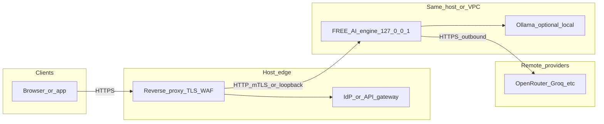

# FREE AI — enterprise self-hosted deployment

**Status:** Human-facing merge / operations contract. Not loaded by the engine at runtime.

## Trust boundary

1. **Bind** the Node process to `127.0.0.1` (default in `src/server.js`).
2. Place **TLS termination**, **authentication**, and **rate limiting** on a reverse proxy (nginx, Caddy, Envoy, API gateway).
3. Treat `/v1/infer` as **sensitive** unless the proxy enforces auth; optionally enable in-engine **`FREEAI_REQUIRE_INFER_TOKEN`** + `FREEAI_INFER_API_KEY`.

## Streaming and query-URL privacy

- **`GET /v1/stream?prompt=...`** puts the prompt in the **URL query string**, which often appears in **reverse-proxy access logs**, **browser history**, and **Referer** headers. Prefer **`POST /v1/stream`** with a JSON body for production clients.
- At the proxy, consider **scrubbing or excluding** `prompt` query parameters from access logs if you must keep `GET` for compatibility.

## Reference deployment topology

Single-region pilot: **clients and admin UIs never talk to the engine port directly** in production; they talk to a **reverse proxy** that terminates TLS, enforces auth (SSO or API keys for humans, service identity for apps), and forwards to the engine on loopback or a private interface.

**Notes**

- **127.0.0.1:** Engine listens on loopback so only local processes (or the proxy’s worker) can connect unless you explicitly bind elsewhere.
- **mTLS (optional):** Service-to-service from an adjacent sidecar or mesh to the proxy is a common pattern; the engine itself does not terminate mutual TLS for upstream callers.
- **Secrets:** Prefer a vault or cloud secret manager for `ADMIN_API_KEY`, provider keys, and `FREEAI_INFER_API_KEY`; inject at process start, never bake into images for production.

## DLP: host vs in-engine boundary

- **In-engine (optional):** `FREEAI_DLP_REDACT_PII=1` enables the **reference** regex redactor on `/v1/infer` responses (string bodies, selected **top-level** JSON string fields per `FREEAI_DLP_JSON_STRING_FIELDS`, and **streaming** text chunks). See `src/security/dlpHook.js`.
- **Shallow JSON by default:** Only **top-level** keys listed in `FREEAI_DLP_JSON_STRING_FIELDS` are redacted on object bodies. Nested assistant text (for example `choices[0].message.content`) is **not** redacted unless you set **`FREEAI_DLP_REDACT_OPENAI_CHOICES=1`** (OpenAI-style `choices` array only).
- **Trusted-payload bypass (dangerous if misused):** `FREEAI_DLP_ALLOW_SUBSTR` — comma-separated markers; if the full serialized payload **contains** any marker, PII redaction is **skipped** (internal traffic only). Avoid **short** markers (e.g. single letters) that could appear in untrusted user text by accident.
- **JSON fields:** `FREEAI_DLP_JSON_STRING_FIELDS` — comma-separated keys (default includes `text,message,content,answer,body`).
- **Metrics disk failures:** Set `FREEAI_LOG_METRIC_ERRORS=1` to log throttled errors when the metrics JSONL file cannot be appended (default path `data/metrics.jsonl`, or **`FREEAI_METRICS_JSONL`** for an absolute path; default: silent so requests are not failed by telemetry I/O).
- This stack is best-effort and **not** a substitute for enterprise DLP at the gateway or on log/messaging sinks.
- **Host-owned (recommended for golden grade):** Field-level redaction in the app layer, egress proxies, SIEM rules, and review queues for model outputs. See [DATA_CLASSIFICATION_AND_RETENTION.md](DATA_CLASSIFICATION_AND_RETENTION.md).

## Security environment variables

| Variable | Purpose |
|----------|---------|
| `NODE_ENV=production` or `FREEAI_PRODUCTION_PROFILE=1` | Enables **production profile**: stricter CORS default (no `*`); combine with admin key requirement. |
| `FREEAI_REQUIRE_ADMIN_KEY=1` | Requires `ADMIN_API_KEY` to be set; `/admin/*` returns 401 without valid `X-Admin-Key` or `Authorization: Bearer`. |
| `ADMIN_API_KEY` | Shared secret for admin routes (required when production profile or `FREEAI_REQUIRE_ADMIN_KEY`). |
| `FREEAI_CORS_ALLOW_ORIGINS` | Comma-separated list of allowed `Origin` values (e.g. `https://app.example.com`). Use `*` only if you explicitly want wildcard. |
| `FREEAI_REQUIRE_INFER_TOKEN=1` | Requires `Authorization: Bearer` or `X-Infer-Key` matching `FREEAI_INFER_API_KEY` (or `settings.json` `infer_api_key`). |
| `FREEAI_INFER_API_KEY` | Secret for infer/render/stream when infer token is required. |
| `FREEAI_DLP_REDACT_PII=1` | Enables **reference** regex PII redaction on infer responses (strings, selected JSON fields, stream chunks — see `src/security/dlpHook.js`). |
| `FREEAI_DLP_ALLOW_SUBSTR` | Comma-separated internal markers; if present in payload, skip redaction (**trusted routes only**). |
| `FREEAI_DLP_JSON_STRING_FIELDS` | Comma-separated top-level JSON keys on `body` to redact when infer returns an object. |
| `FREEAI_DLP_REDACT_OPENAI_CHOICES=1` | Also redact `choices[].message.content` strings on object bodies (opt-in). |
| `FREEAI_LOG_METRIC_ERRORS=1` | Log throttled warnings when metric append to `data/metrics.jsonl` fails. |
| `FREEAI_BIND_HOST` | Bind address (default `127.0.0.1`). Use `0.0.0.0` only for **optional** container/pod networking behind a secure mesh or cluster SDN. |

`settings.json` may set: `production_profile`, `require_admin_key`, `cors_allow_origins` (array or string), `require_infer_token`, `infer_api_key`, `dlp_redact_pii`, `port`.

## Startup validation

If admin key is required but `ADMIN_API_KEY` is missing, the process **exits** before listening. Same if infer token is required without a configured infer key.

## Enterprise rollout preflight (Steps 1–2)

1. **Validate trust config without starting the server:** `node scripts/validate_enterprise_trust.js` (optional strict CORS: `FREEAI_VALIDATE_TRUST_STRICT=1`).
2. **Reverse proxy examples:** [examples/reverse_proxy/Caddyfile.example](examples/reverse_proxy/Caddyfile.example).
3. **Metrics → SIEM / Prometheus:** [examples/prometheus/README.md](examples/prometheus/README.md) and [runbooks/slo_error_budgets.md](runbooks/slo_error_budgets.md).
4. **Data governance template:** [ENTERPRISE_DATA_GOVERNANCE_CHECKLIST.md](ENTERPRISE_DATA_GOVERNANCE_CHECKLIST.md).
5. **Model cadence:** [MODEL_GOVERNANCE_CADENCE.md](MODEL_GOVERNANCE_CADENCE.md).
6. **Release evidence pack:** `node scripts/collect_release_evidence.js` (see [templates/RELEASE_EVIDENCE_CHECKLIST.md](templates/RELEASE_EVIDENCE_CHECKLIST.md)).
7. **Kubernetes secrets overlay:** [deploy/kustomize/overlays/staging-secret-env/README.md](../deploy/kustomize/overlays/staging-secret-env/README.md).
8. **Platform extensions (post-enterprise):** [POST_ENTERPRISE_EXTENSIONS.md](POST_ENTERPRISE_EXTENSIONS.md).

## Backup scope

Back up from the vendored engine root:

- `providers.json`, `settings.json`, `.env` (never commit secrets)
- `data/` (metrics, model control plane snapshots when generated)
- `memory/`, `evidence/`, `acquisition/` as used by your deployment

## SBOM

Run `node scripts/generate_sbom.js` after `npm ci` to write `dist/sbom.json` (CycloneDX) for vendor / security questionnaires.

## GitHub Actions

If this engine is the **git repository root**, workflows in `.github/workflows/` run as-is. If FREE AI lives in a **monorepo subdirectory**, copy the job to the repository root and set `defaults.run.working-directory` to that subdirectory (and fix `cache-dependency-path`).

The default CI job runs **`quality_gate.js --fast`** (which already includes the full test suite) plus **`validate_enterprise_trust.js`** with **dummy** production-like secrets — CI-only values, never real keys.

## Release checklist

1. `node scripts/validate_enterprise_trust.js` (with the same env you use in production)
2. `node scripts/quality_gate.js --fast`
3. `node scripts/run_all_tests.js`
4. `node scripts/build_integration_kit.js`
5. Optional: `FREEAI_REFRESH_SKIP_NETWORK=1 node scripts/refresh_model_catalog.js`
6. `node scripts/generate_sbom.js`
7. Optional bundle: `node scripts/collect_release_evidence.js` (or `--fast` for a quicker gate inside the pack)

See [runbooks](runbooks/) for incidents and key rotation.
