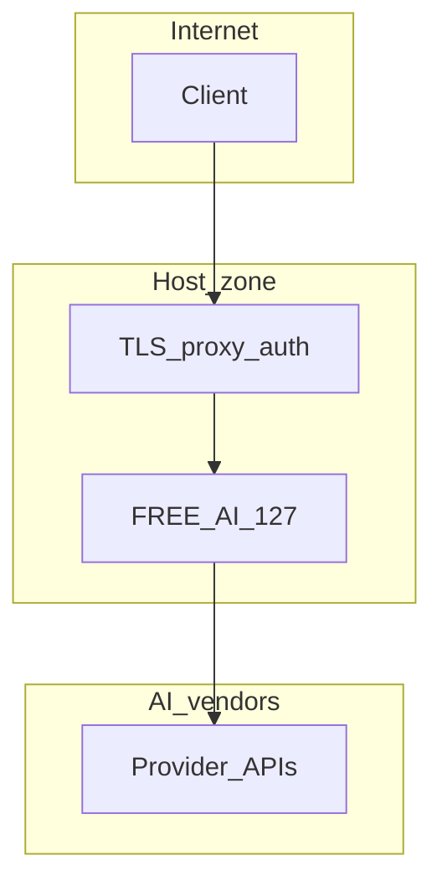

# FREE AI — STRIDE-lite threat model (template)

**Status:** Human-facing. Complete with your security team before production.

## Assets

- API keys (admin, infer, providers)
- Prompts and model outputs
- Receipts, evidence, training state on disk
- Integrity of `providers.json` / catalog snapshots

## Trust boundaries

## STRIDE summary

| Type | Example threat | Mitigation direction |
|------|----------------|---------------------|
| Spoofing | Forged admin calls | `ADMIN_API_KEY`, proxy auth |
| Tampering | Modified `providers.json` | Git + signed releases, file integrity monitoring |
| Repudiation | Denied admin action | Append-only logs at proxy; engine receipts |
| Information disclosure | Key in logs | Never log raw secrets; redact |
| Denial of service | Flood `/v1/infer` | Rate limit at proxy; engine cooldowns |
| Elevation | Infer calls admin | Separate keys; least privilege |

## Residual risk

Engine relies on **correct host deployment**; misconfigured proxy or leaked `.env` bypasses in-repo controls.
